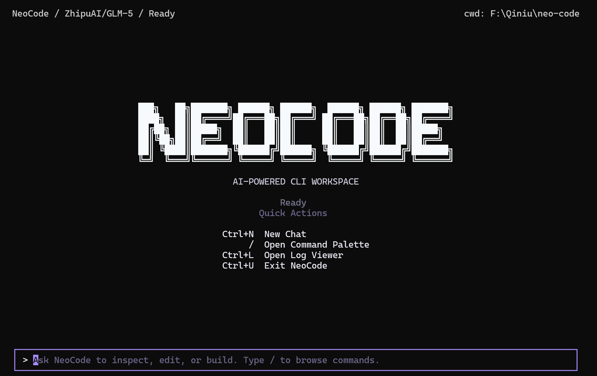
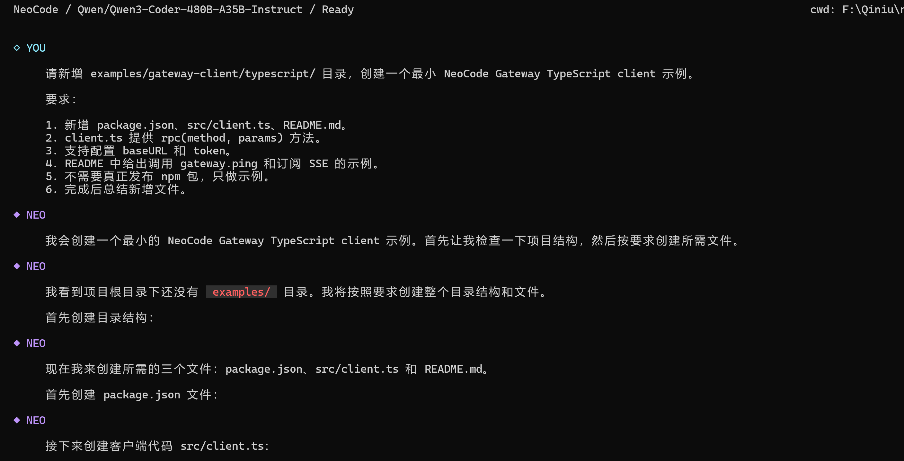

[中文](README.md) | [EN](README.en.md)

# NeoCode

> A local-first AI coding agent that helps you understand code, edit projects, call tools, and connect your workflow across terminal, desktop, and automation.

<p align="center">
  <a href="https://go.dev/">
    
  </a>
  <a href="https://github.com/1024XEngineer/neo-code/actions/workflows/ci.yml">
    
  </a>
  <a href="https://github.com/1024XEngineer/neo-code/blob/main/LICENSE">
    
  </a>
  <a href="https://neocode-docs.pages.dev/">
    
  </a>
  <a href="https://neocode-docs.pages.dev/en/guide/install">
    
  </a>
</p>

<p align="center">
  <a href="https://neocode-docs.pages.dev/en/">Docs</a>
  ·
  <a href="https://github.com/1024XEngineer/neo-code/issues">Issues</a>
  ·
  <a href="https://github.com/1024XEngineer/neo-code/discussions">Discussions</a>
</p>

---

## What Is NeoCode?

NeoCode is an AI coding agent running in your local development environment.

It can read your workspace, understand code, call tools, run commands, manage sessions, and expose a unified local Gateway interface (JSON-RPC / SSE / WebSocket) for terminal, desktop, or third-party clients.

Core loop:

`User Input (TUI) -> Gateway Relay -> Runtime Reasoning -> Tool Calls -> Result Feedback -> UI Rendering`

---

## Features

- Local-first execution with real project context.
- Terminal-native TUI experience.
- Built-in tools for file access, project inspection, and command execution.
- Multi-provider support: OpenAI, Gemini, ModelScope, Qiniu, OpenLL, plus custom providers.
- Session persistence and recovery.
- Memory for preferences and project facts across sessions.
- Skills system for task-specific behaviors.
- MCP integration via stdio servers.
- Gateway mode with local JSON-RPC / SSE / WebSocket access.

---

## Preview





---

## Quick Start

### 1. Install

macOS / Linux:

```bash
curl -fsSL https://raw.githubusercontent.com/1024XEngineer/neo-code/main/scripts/install.sh | bash
```

Windows PowerShell:

```powershell
irm https://raw.githubusercontent.com/1024XEngineer/neo-code/main/scripts/install.ps1 | iex
```

### 2. Run from source

```bash
git clone https://github.com/1024XEngineer/neo-code.git
cd neo-code
go run ./cmd/neocode
```

### 3. Configure API key

Set environment variables for your provider, for example:

```bash
export OPENAI_API_KEY="your_key_here"
```

Windows PowerShell:

```powershell
$env:OPENAI_API_KEY = "your_key_here"
```

Then start with your workspace:

```bash
neocode --workdir /path/to/your/project
```

### 4. Common commands

```text
/help                 Show help
/provider             Switch provider
/model                Switch model
/compact              Compact current session context
/cwd [path]           Show or change workspace
/memo                 Show memory
/remember <text>      Save memory
/skills               List available skills
/skill use <id>       Enable skill
/skill off <id>       Disable skill
```

---

## Gateway / MCP / Skills

Detailed docs are intentionally split out. README keeps entry links:

- Gateway integration and protocol: `docs/guides/gateway-integration-guide.md`
- MCP configuration: `docs/guides/mcp-configuration.md`
- Skills design: `docs/skills-system-design.md`
- Runtime event flow: `docs/runtime-provider-event-flow.md`

---

## Documentation

- Official docs site: [https://neocode-docs.pages.dev/en/](https://neocode-docs.pages.dev/en/)
- English guide index: [www/en/guide/index.md](www/en/guide/index.md)

Docs site source lives in `www/`. Local preview:

```bash
cd www
pnpm install
pnpm docs:dev
```

---

## Contributing

Contributions are welcome via Issues, Discussions, and Pull Requests.

Suggested flow:

1. Open an issue for problems, requirements, or design proposals.
2. Fork and create a focused feature branch.
3. Keep changes scoped and explain impact clearly.
4. Run checks before submitting:

```bash
gofmt -w ./cmd ./internal
go test ./...
go build ./...
```

---

## License

MIT
