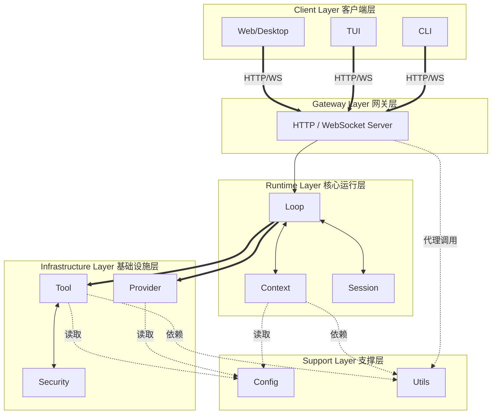

# NeoCode 系统架构总览（HLD）

> 文档版本：v3.2.0
> 文档定位：系统级架构设计（HLD）
> 事实源目录：`.\docs\architecture`

## 1. 引言

### 1.1 目的

本文档定义 NeoCode 的系统级架构边界、模块关系、核心链路与跨层契约绑定规则，作为开发、测试、评审、联调的统一依据。

### 1.2 范围

- 包含：系统分层、模块职责矩阵、核心链路、跨层契约映射、多模态约束、文档导航。
- 不包含：模块内部实现细节、字段级实现差异、具体编码步骤。

### 1.3 文档分工

- 根 `README.md`：系统目标、边界、链路、契约绑定规则。
- 模块 `README.md`：模块内部设计、机制说明、联调约束。
- 模块 `interface.go`：结构体/接口契约定义（权威类型来源）。

## 2. 规范词约定

- `MUST`：必须满足的架构契约。
- `SHOULD`：强烈建议遵循，例外需记录原因。
- `MAY`：可选增强能力。

## 3. 设计原则

- 解耦优先：模块通过稳定契约通信，禁止跨层耦合内部实现。
- 契约优先：先定义接口与事件语义，再推进实现。
- 状态归属清晰：会话、配置、上下文、事件存在单一权威归属。
- 安全默认开启：权限、工作区边界、密钥保护属于基础能力。
- 多模态兼容：输入契约统一承载文本与非文本内容。

## 4. 总体架构

### 4.1 架构要求

- CLI、TUI、Web MUST 通过 Gateway 与 Runtime 交互。
- Gateway MUST 通过 `gateway.Gateway` 契约负责协议适配与连接管理，不承载业务编排。
- Runtime MUST 作为唯一编排中心，负责链路生命周期与终态收敛。
- Provider MUST 吸收模型厂商差异，向上游输出统一协议。
- Tools MUST 作为工具执行边界，负责权限与结果归一。
- Security MUST 作为统一权限治理边界，负责策略命中、审批事件与会话级记忆。
- Utils MUST 通过 `utils.Registry` 契约提供统一辅助能力入口。

## 5. 模块职责矩阵（逻辑依赖 + 契约关系）

| 模块 | 系统级职责 | 逻辑上游 | 逻辑下游 | 关键契约锚点 |
|---|---|---|---|---|
| Gateway | 协议适配、连接管理、入口路由 | Client | Runtime / Utils | `gateway.Gateway`、`gateway.MessageFrame` |
| Runtime | 回合编排、事件发布、状态收敛 | Gateway | Context / Provider / Tools / Session / Config | `runtime.UserInput`、`runtime.CompactInput` |
| Context | Prompt 组装、上下文压缩、作用域隔离 | Runtime | Config / Utils | `context.BuildInput`、`context.BuildResult` |
| Provider | 模型协议抹平、流式事件归一、能力判定 | Runtime | 模型供应商 API | `provider.GenerateRequest`、`provider.StreamEvent` |
| Tools | 工具执行、审批拦截、输出归一 | Runtime | 本地/远端执行器 | `tools.ToolCallInput`、`tools.ToolResult` |
| Security | 权限判定、审批事件、session 记忆、工作区边界复核 | Tools / Runtime | 策略规则与审批交互 | `security.Action`、`security.CheckResult` |
| Session | 会话持久化、摘要视图、状态恢复 | Runtime | 存储介质 | `session.Store`、`session.Session`、`session.SessionSummary` |
| Config | 配置加载、校验、更新、快照提供 | Runtime / Gateway | 配置文件与环境变量 | `config.Registry` |
| Utils | 通用辅助能力（Token/路径/解析/序列化） | Gateway / Runtime / Context / Tools | 基础库 | `utils.Registry` |
| Client | 输入采集、交互展示、命令入口 | 用户 | Gateway | 网关协议帧 |

## 6. 核心主链路

1. Client 通过 HTTP/WS 向 Gateway 发送请求。
2. Gateway 解析协议帧并转发为 Runtime 输入。
3. Runtime 读取 Session 与 Config，调用 Context 构建模型上下文。
4. Runtime 调用 Provider 获取流式事件，按需调度 Tools 执行并回灌。
5. Runtime 发布过程事件与终态事件，并回写 Session。
6. Gateway 将事件流转发给 Client 完成展示与交互闭环。

## 7. 跨层契约映射表（Interface Binding）

| 通信链路 | 请求/输入契约 | 输出/事件契约 | 通信语义 |
|---|---|---|---|
| `Client <-> Gateway` | `gateway.MessageFrame` | `gateway.MessageFrame` | 统一协议帧承载 HTTP/WS 消息 |
| `Gateway -> Runtime` | `runtime.UserInput`、`runtime.CompactInput` | `runtime.RuntimeEvent` | 网关将请求映射为运行命令 |
| `Runtime -> Context` | `context.BuildInput`、`context.AdvancedBuildInput` | `context.BuildResult` | 编排层请求上下文构建 |
| `Runtime -> Provider` | `provider.GenerateRequest` | `provider.StreamEvent` | 模型生成调用与流式事件回传 |
| `Runtime -> Tools` | `tools.ToolCallInput` | `tools.ToolResult` | 工具执行与结果回灌 |
| `Tools / Runtime -> Security` | `security.Action` / `runtime.PermissionResolutionInput` | `security.CheckResult` / 审批事件 | 权限判定、审批闭环、session 记忆 |
| `Runtime <-> Session` | `session.Store` | `session.Session`、`session.SessionSummary` | 会话读写与摘要查询 |
| `Runtime <-> Config` | `config.Registry` | `config.Config` | 配置读取与更新事务 |
| `Runtime/Context/Tools/Gateway -> Utils` | `utils.Registry` | 各子能力接口返回值 | 统一辅助能力调用入口 |

## 8. 多模态输入与能力协商

- 多模态输入 MUST 通过 `provider.MessagePart + provider.AssetRef` 统一表达文本与非文本内容。
- Provider MUST 通过 `provider.ModelDescriptor` 与 `provider.ModelCapabilityHints` 提供模型能力协商依据。
- 请求模态超出模型能力时，Provider MUST 返回 `provider.ErrorCodeUnsupportedModality`。
- Runtime SHOULD 基于模态能力错误执行恢复路径（模型切换、输入降级、用户提示）。

## 9. 术语禁用与写作约束

- 根 README 不使用“实现旁路”替代官方架构路径。
- 根 README 不混写双入口路径表述。
- 入口、上下游、链路关系必须绑定到 `interface.go` 中的契约类型名。
- 模块细节下沉到模块文档，不在根 README 展开字段级说明。

## 10. 文档导航与阅读顺序

1. 先读本文档：系统边界、单入口链路、契约映射。
2. 再读核心编排：`runtime`、`session`。
3. 再读协议与执行：`context`、`provider`、`tools`、`security`、`config`。
4. 最后读入口与支撑：`gateway`、`tui`、`cli`、`utils`。

---

本文档仅承载系统级架构定义。模块级实现细节请查看对应模块文档。

