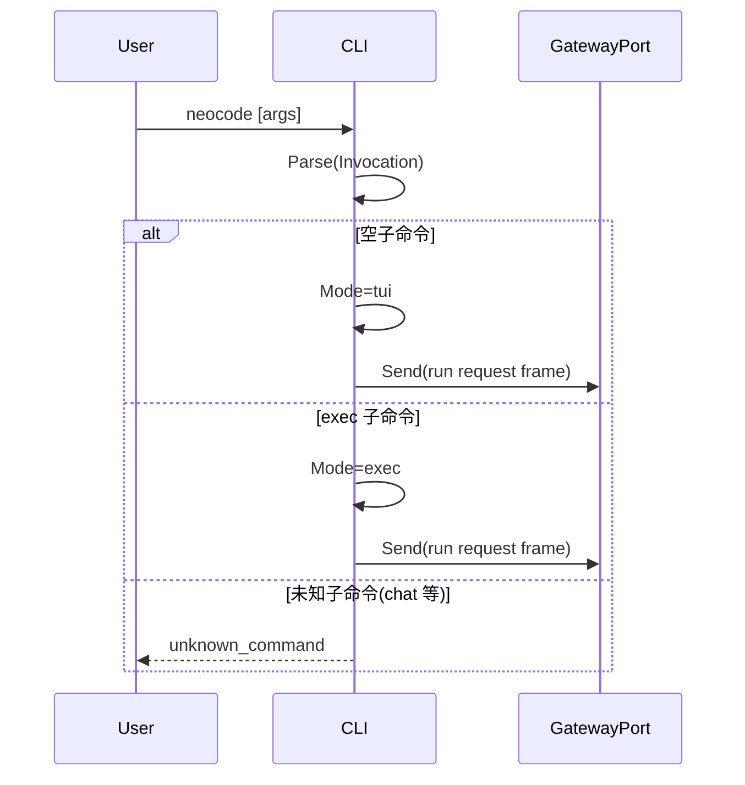

# CLI 模块设计与接口文档

> 文档版本：v3.1
> 文档定位：详细设计文档（LLD）+ 接口文档（API/Contract）

## 规范词约定

- `MUST`：必须满足的架构契约，违反会导致入口语义不一致。
- `SHOULD`：强烈建议遵循，若例外必须记录原因。
- `MAY`：可选增强能力。

## 1. 详细设计（LLD）

### 1.1 目的与范围

CLI 模块是终端入口层，负责命令解析、模式分派、标准流管理，并把请求发送到 Gateway。

CLI 模块 MUST 覆盖：

- 启动模式解析（默认 TUI、无头 exec）。
- 参数校验与错误提示。
- 与 Gateway 的帧级通信。
- 无头执行输出策略（流式 / 仅最终）。

CLI 模块 MUST NOT 覆盖：

- 运行时编排。
- 模型调用、工具执行、会话持久化。

### 1.2 启动语义

- `neocode` MUST 直接进入 TUI 交互模式。
- `neocode exec` MUST 进入无头执行模式。
- CLI 不定义独立 `chat` 子命令；输入 `chat` SHOULD 返回未知子命令并提示使用 `neocode`。

### 1.3 核心流程



### 1.4 Invocation 校验约束

- `Invocation.Argv` MUST 非 `nil`；空切片表示“无参数”。
- `Invocation.Workdir` MUST 为绝对路径。
- `ExecRequest.Workdir` 若非空 MUST 为绝对路径。
- `Parse` 在上述约束失败时 MUST 返回稳定错误码：`invalid_argv`、`invalid_workdir`。

### 1.5 上下游边界

- 上游：终端用户与 Shell。
- 下游：`gateway.Gateway` 提供的客户端通信端口（文档契约为 `cli.GatewayPort`）。
- 边界约束：CLI 不直连 Runtime、Provider、Tools。

## 2. 接口文档（API/Contract）

### 2.1 公共规范

- 主契约 MUST 为 `cli.CLI`。
- 模式解析 MUST 输出 `Mode`。
- 无头执行请求 MUST 使用 `ExecRequest` 明确输出模式。

### 2.2 接口目录

| 接口 | 职责 |
|---|---|
| `CLI` | CLI 唯一主契约（解析 + 执行） |
| `GatewayPort` | CLI 下游网关端口（发送帧 + 订阅事件） |

### 2.3 关键类型目录

| 类型 | 说明 |
|---|---|
| `Invocation` | 一次 CLI 调用上下文 |
| `DispatchResult` | 解析结果 |
| `Mode` | `tui` / `exec` |
| `ExecRequest` | 无头执行请求 |
| `ExecOutputMode` | `stream` / `final` |

### 2.4 解析结果与错误示例

#### 2.4.1 `neocode` 解析结果

```json
{
  "mode": "tui",
  "exec": null
}
```

#### 2.4.2 `neocode exec` 解析结果

```json
{
  "mode": "exec",
  "exec": {
    "prompt": "请总结最近一次构建错误",
    "output_mode": "stream",
    "session_id": "sess_abc",
    "workdir": "/workspace/project"
  }
}
```

#### 2.4.3 参数校验失败示例

```json
{
  "code": "invalid_workdir",
  "message": "workdir must be absolute path"
}
```

#### 2.4.4 未知子命令示例

```json
{
  "code": "unknown_command",
  "message": "unknown subcommand: chat, use `neocode` to start TUI"
}
```

### 2.5 变更规则

- 新增模式或输出策略 MUST 向后兼容。
- `neocode` 默认 TUI 与 `neocode exec` 语义 MUST 保持稳定。
- 子命令语义变更 SHOULD 经版本化流程并给出迁移提示。

## 3. 评审检查清单

- 是否明确 `CLI` 为唯一主契约锚点。
- 是否固化默认启动语义（`neocode`=TUI，`exec`=无头）。
- 是否明确不定义独立 `chat` 子命令。
- 是否包含 `Invocation` 参数硬约束与错误码约束。
- 是否明确 CLI 下游仅 Gateway。
- README 类型名是否与 `cli/interface.go` 一致。