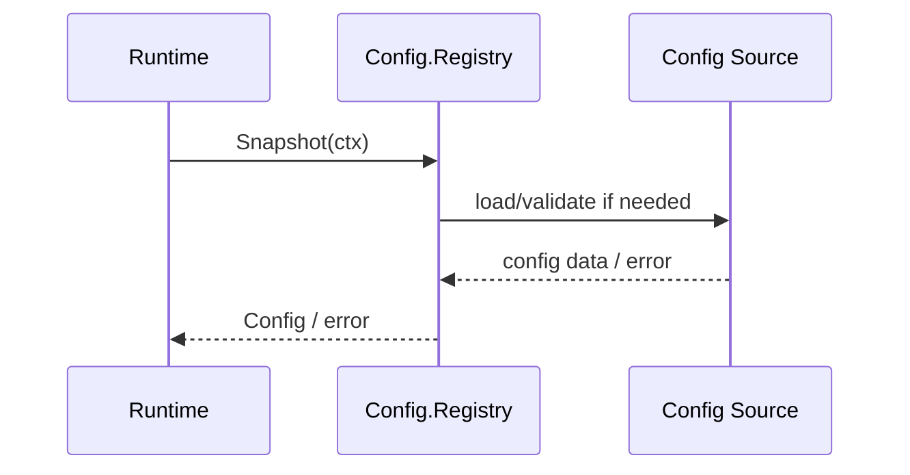
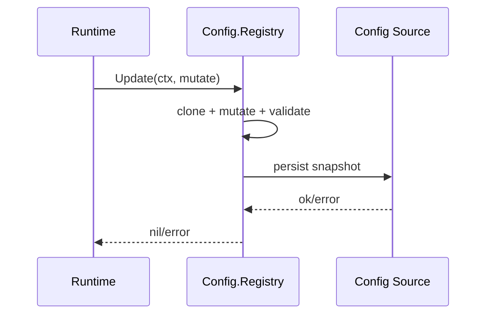
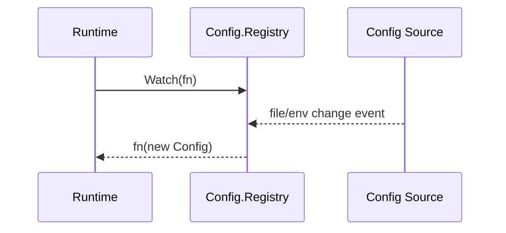

# Config 模块设计与接口文档

> 文档版本：v3.0
> 文档定位：详细设计文档（LLD）+ 接口文档（API/Contract）

## 规范词约定

- `MUST`：必须满足的架构契约，违反会破坏配置一致性与联调稳定性。
- `SHOULD`：强烈建议遵循，若例外必须记录原因。
- `MAY`：可选增强能力。

## 1. 详细设计（LLD）

### 1.1 目的与范围

Config 模块负责配置加载、校验、更新、快照分发与变更监听，为 Runtime、Gateway、Provider、Tools 提供一致配置事实源。

Config 模块 MUST 覆盖：

- 运行配置快照读取。
- 事务化配置更新。
- 配置变更监听与回调分发。
- Provider 配置与密钥引用语义管理。

Config 模块 MUST NOT 覆盖：

- 模型调用（由 Provider 负责）。
- 工具执行（由 Tools 负责）。
- 会话持久化（由 Session 负责）。

### 1.2 架构链路定位

- Config 的直接调用方 MUST 是 Runtime（以及配置入口相关网关能力）。
- Client 不直接读写底层配置文件，而是通过 Gateway/Runtime 触发配置变更。
- 在系统单入口模型中，路径为 `Client -> Gateway -> Runtime <-> Config`。

### 1.3 模块边界

- 上游：Runtime、Gateway。
- 下游：配置文件加载器、环境变量解析器、持久化介质。
- 边界约束：Config 只输出标准 `Config` 快照与配置错误语义。

### 1.4 核心流程

#### 1.4.1 Snapshot 读取流程



#### 1.4.2 Update 事务流程



#### 1.4.3 Watch 推送流程



### 1.5 安全与密钥约束

- API Key MUST 通过环境变量名引用（`APIKeyEnv`），不得明文持久化在配置文件中。
- `ResolvedProviderConfig` SHOULD 只在受控运行时上下文短生命周期使用。
- 配置变更日志 MUST 避免输出明文密钥。

### 1.6 非功能约束

- 一致性：Snapshot/Update 语义 MUST 保持原子与可预测。
- 并发性：读取 MUST 支持并发，写入 SHOULD 串行化。
- 可观测性：关键配置错误 SHOULD 可追踪并可诊断。

## 2. 接口文档（API/Contract）

### 2.1 公共规范

- 所有配置读写方法 MUST 接收 `context.Context`。
- 配置更新 MUST 通过 `Update` 事务入口执行。
- 读取方 SHOULD 基于快照消费，避免持有可变引用。

### 2.2 接口目录

| 接口 | 职责 |
|---|---|
| `Registry` | 主配置契约（Snapshot/Update/Watch） |
| `ManagerLike` | 兼容层接口（用于迁移期与历史调用适配） |

### 2.3 关键类型目录

| 类型 | 说明 |
|---|---|
| `Config` | 运行配置快照 |
| `ProviderConfig` | Provider 基础配置 |
| `ResolvedProviderConfig` | 补齐密钥后的 Provider 配置 |

### 2.4 跨层契约绑定

| 链路 | 输入契约 | 输出契约 | 说明 |
|---|---|---|---|
| `Runtime <-> Config` | `config.Registry` | `config.Config` | 配置读取与事务更新 |
| `Runtime -> Provider` | `config.Config` | `provider.ProviderRuntimeConfig` | 运行配置映射到 provider 构建参数 |

### 2.5 JSON 示例

#### 2.5.1 Snapshot 成功示例

```json
{
  "providers": [
    {
      "name": "openai-main",
      "driver": "openai",
      "base_url": "https://api.openai.com/v1",
      "model": "gpt-4.1",
      "api_key_env": "OPENAI_API_KEY"
    }
  ],
  "selected_provider": "openai-main",
  "current_model": "gpt-4.1",
  "workdir": "C:/workspace/demo",
  "shell": "powershell",
  "max_loops": 12,
  "tool_timeout_sec": 60
}
```

#### 2.5.2 Update 失败示例

```json
{
  "code": "config_validation_failed",
  "message": "selected_provider not found in providers"
}
```

### 2.6 变更规则

- 新增字段 MUST 保持向后兼容。
- 字段改名/删除 MUST 经过版本化流程并提供迁移窗口。
- 主契约演进 SHOULD 优先扩展 `Registry`，兼容层仅用于过渡。

## 3. 评审检查清单

- 是否明确 `Registry` 为主契约锚点。
- 是否包含 Snapshot/Update/Watch 全流程与示例。
- 是否明确 API Key 只通过环境变量名引用。
- 是否定义并发与一致性语义。
- 是否与 `config/interface.go` 类型名保持一致。
