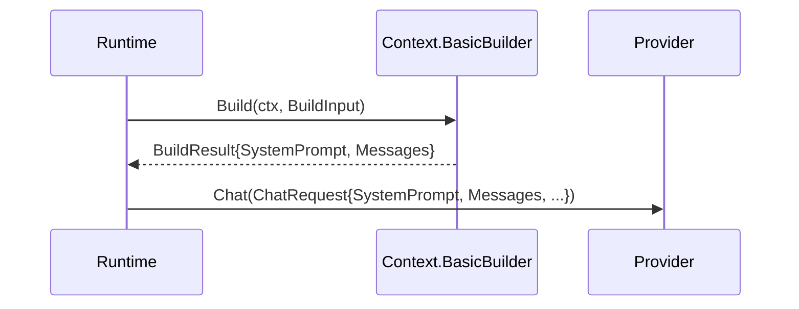
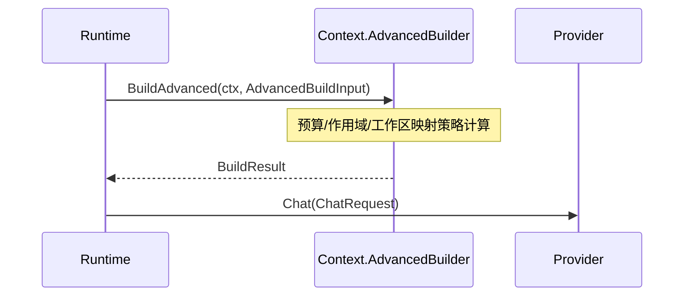

# Context 模块设计与接口文档

> 文档版本：v3.0
> 文档定位：详细设计文档（LLD）+ 接口文档（API/Contract）

## 规范词约定

- `MUST`：必须满足的架构契约，违反会破坏跨模块联调稳定性。
- `SHOULD`：强烈建议遵循，若例外必须记录原因与替代方案。
- `MAY`：可选增强能力，不影响主链路成立。

## 1. 详细设计（LLD）

### 1.1 目的与范围

Context 模块负责将 Runtime 提供的会话消息与运行元数据加工为 Provider 可消费的上下文输入。

Context 模块 MUST 覆盖：

- 系统提示词组装。
- 消息窗口裁剪与结构保持。
- 基础构建路径与高级构建路径。
- 与压缩策略相关的预算语义承载。

Context 模块 MUST NOT 覆盖：

- 工具执行（由 Tools 负责）。
- 会话持久化（由 Session 负责）。
- 模型协议适配与请求发送（由 Provider + Runtime 负责）。

### 1.2 架构链路定位

- Context 的直接调用方 MUST 是 Runtime。
- Provider 的直接调用方 MUST 也是 Runtime。
- Context 不直接调用 Provider。
- 数据映射链为：`context.BuildResult -> Runtime -> provider.ChatRequest`。

### 1.3 模块边界

- 输入边界：`BuildInput` 或 `AdvancedBuildInput`。
- 输出边界：`BuildResult`（`SystemPrompt + Messages`）。
- 约束边界：Context 不直接写会话、不直接调用工具、不直接发起模型请求。

### 1.4 双接口分层设计

- `BasicBuilder`：面向基础构建，输入 `BuildInput`。
- `AdvancedBuilder`：面向预算与作用域控制，输入 `AdvancedBuildInput`。
- 两条路径 MUST 输出同构 `BuildResult`，避免 Runtime 装配分叉。

### 1.5 核心流程

#### 1.5.1 基础构建流程



#### 1.5.2 高级构建流程



### 1.6 非功能约束

- 可观测性：Context SHOULD 输出可追踪构建错误语义，便于 Runtime 统一记录。
- 稳定性：消息角色与模态结构 MUST 保持稳定，不得在构建阶段重写角色语义。
- 扩展性：高级输入字段扩展 SHOULD 通过新增字段演进，不破坏现有构建路径。

## 2. 接口文档（API/Contract）

### 2.1 公共规范

- 所有方法 MUST 接收 `context.Context`。
- 构建失败 MUST 通过 `error` 返回，由 Runtime 统一处理。
- 输出的 `Messages` MUST 保持 `provider.Message` 语义兼容。

### 2.2 接口目录

| 接口 | 职责 |
|---|---|
| `BasicBuilder` | 基础上下文构建 |
| `AdvancedBuilder` | 高级上下文构建 |

### 2.3 关键类型目录

| 类型 | 说明 |
|---|---|
| `BuildInput` | 基础输入（`Messages + Metadata`） |
| `AdvancedBuildInput` | 高级输入（基础输入 + 预算/作用域/映射） |
| `BuildResult` | 标准输出（`SystemPrompt + Messages`） |
| `TokenBudget` | 预算语义 |
| `LoopState` | 编排状态 |
| `WorkspaceMap` | 工作区映射 |
| `TaskScope` | 子任务作用域 |

### 2.4 跨层契约绑定

| 链路 | 输入契约 | 输出契约 | 说明 |
|---|---|---|---|
| `Runtime -> Context`（基础） | `context.BuildInput` | `context.BuildResult` | 基础消息构建 |
| `Runtime -> Context`（高级） | `context.AdvancedBuildInput` | `context.BuildResult` | 预算与作用域控制构建 |
| `Runtime -> Provider`（映射后发送） | `context.BuildResult` | `provider.ChatRequest` | Runtime 执行桥接映射并发起请求 |

### 2.5 示例

#### 2.5.1 基础构建输入示例

```json
{
  "messages": [
    {
      "role": "user",
      "parts": [
        {"type": "text", "text": "帮我解释这段代码"}
      ]
    }
  ],
  "metadata": {
    "workdir": "C:/workspace/demo",
    "shell": "powershell",
    "provider": "openai",
    "model": "gpt-4.1"
  }
}
```

#### 2.5.2 构建输出示例

```json
{
  "system_prompt": "你是 NeoCode 的编程助手，遵循项目规则与工具边界。",
  "messages": [
    {
      "role": "user",
      "parts": [
        {"type": "text", "text": "帮我解释这段代码"}
      ]
    }
  ]
}
```

#### 2.5.3 失败示例

```json
{
  "code": "context_build_failed",
  "message": "token budget invalid: reserve exceeds context window"
}
```

### 2.6 变更规则

- 新增输入字段 MUST 向后兼容。
- 字段重命名或语义变更 MUST 通过版本化流程并提供迁移窗口。
- 高级路径新增策略 SHOULD 不影响基础路径契约。

## 3. 评审检查清单

- 是否明确 Runtime 是 Context 与 Provider 的直接调用方。
- 是否区分“调用链”与“数据映射链”。
- 基础/高级路径是否共享统一输出。
- 是否包含可联调的成功与失败示例。
- 类型命名是否与 `context/interface.go` 一致。
