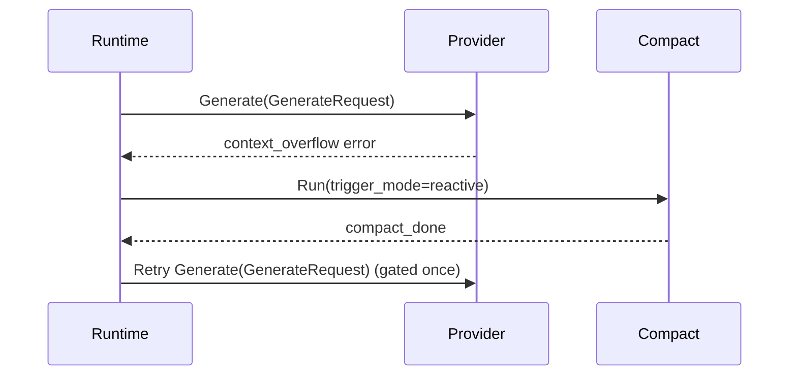
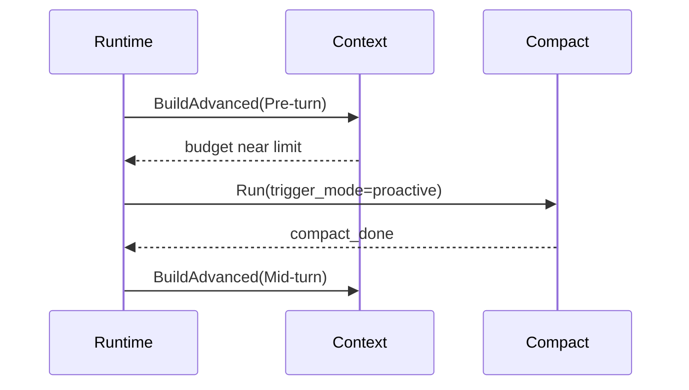

# context-compact

> 文档版本：v2.0
> 文档定位：Context 压缩专题规范（LLD + Contract）

## 1. 目标

本文件定义 Context 压缩机制的统一规范，覆盖触发策略、门禁约束、事件可观测性与失败恢复行为。

## 2. 规范词约定

- `MUST`：必须满足的压缩契约。
- `SHOULD`：强烈建议遵循。
- `MAY`：可选增强能力。

## 3. 触发模式规范

### 3.1 Reactive

- `reactive` MUST 在命中“上下文过长”错误后触发。
- `reactive` MUST 与自动重试门禁绑定，每个 `run_id` 的自动重试次数必须受限。
- `reactive` MUST 产出 `trigger_mode=reactive` 的事件字段。

### 3.2 Proactive

- `proactive` MUST 在两个触发点执行预算检查：
1. `Pre-turn`：每轮模型调用前。
2. `Mid-turn`：工具结果回灌后。
- `proactive` MUST 基于 `TokenBudget` 做判定。
- `proactive` MUST 产出 `trigger_mode=proactive` 的事件字段。

## 4. 门禁与防循环约束

- 系统 MUST 定义 reactive 重试门禁，禁止无限重试循环。
- 系统 MUST 定义 proactive 压缩门禁，禁止高频重复压缩。
- 同一轮内压缩与重试顺序 SHOULD 稳定可复现。
- 门禁拒绝行为 MUST 可观测（事件或日志）。

## 5. 事件契约

- 压缩链路 MUST 产出 `compact_start`、`compact_done`、`compact_error`。
- 以上事件 MUST 包含 `trigger_mode`。
- `compact_done` SHOULD 包含体量指标：`before_chars`、`after_chars`、`saved_ratio`。
- `compact_error` MUST 包含可诊断错误信息。

## 6. 时序示例

### 6.1 Reactive 压缩 + 单次重试



### 6.2 Proactive 预算触发



## 7. JSON 示例

### 7.1 成功示例（compact_done）

```json
{
  "type": "compact_done",
  "payload": {
    "trigger_mode": "reactive",
    "applied": true,
    "before_chars": 180000,
    "after_chars": 42000,
    "saved_ratio": 0.766
  }
}
```

### 7.2 门禁拒绝示例

```json
{
  "type": "compact_error",
  "payload": {
    "trigger_mode": "reactive",
    "message": "retry gate exhausted for run_id=run_123"
  }
}
```

## 8. 变更规则

- 压缩事件新增字段 MUST 保持向后兼容。
- 门禁策略调整 SHOULD 保持错误码与可观测字段稳定。
- 触发模式扩展 MUST 显式声明触发点与门禁规则。

## 9. 评审检查清单

- reactive/proactive 是否都满足 MUST 约束。
- Pre-turn 与 Mid-turn 是否均有可执行判定路径。
- 事件是否包含 `trigger_mode` 与关键指标。
- 是否有门禁拒绝与失败路径示例。

