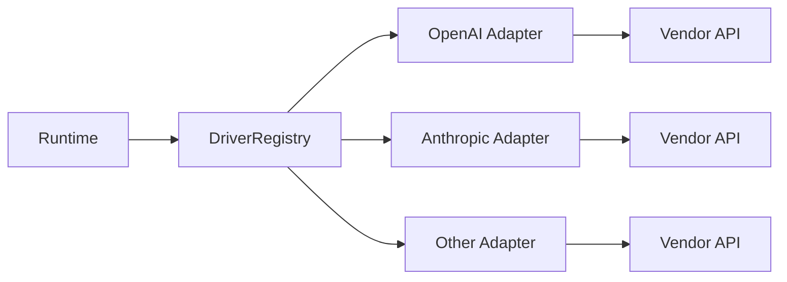

# Provider 模块设计与接口文档

> 文档版本：v1.2
> 文档定位：详细设计文档（LLD）+ 接口文档（API/Contract）

## 规范词约定

- `MUST`：必须满足的架构契约，违反会破坏模块边界或联调稳定性。
- `SHOULD`：强烈建议遵循，特殊场景可例外，但必须记录原因。
- `MAY`：可选能力，用于增强可维护性或可扩展性。

## 1. 详细设计（LLD）

### 1.1 目的与范围

Provider 模块负责抹平不同模型供应商协议差异，为编排层提供统一的模型调用能力与能力判定能力。

Provider 模块 MUST 覆盖：

- 统一消息请求结构与流式事件结构。
- 统一工具调用（tool/function calling）抽象。
- 统一错误分类与可重试语义。
- 驱动注册、构建与模型发现能力。
- 多模态输入能力判定与请求前校验。

Provider 模块 MUST NOT 覆盖：

- Prompt 组装（由 Context 负责）。
- 工具执行（由 Tools 负责）。
- 会话持久化（由 Session 负责）。

### 1.2 架构链路定位

- Provider 的逻辑上游 MUST 是 Runtime 编排层。
- Client 侧（CLI/TUI/Web）不得直接调用 Provider。
- 在系统单入口模型中，调用路径为 `Client -> Gateway -> Runtime -> Provider`。

### 1.3 模块边界

- 上游：Runtime（编排层）。
- 下游：各模型供应商 SDK/HTTP API。
- 交付边界：Provider 输出统一契约，隐藏供应商特定字段与协议分歧。

### 1.4 架构模式

Provider 采用 `Factory + Registry + Adapter` 组合模式：

- Adapter：每个供应商独立实现 `Provider` 接口。
- Registry：负责驱动注册、构建与能力探测。
- Factory：根据配置选择并构建目标驱动实例。



### 1.5 核心流程

#### 1.5.1 同步/流式调用流程

1. Runtime 组装 `ChatRequest` 并调用 `Provider.Chat`。
2. Provider 在请求前执行能力校验（模型存在性、模态支持、参数边界）。
3. Provider Adapter 完成供应商协议转换并发起请求。
4. Adapter 将供应商流式数据归一化为 `StreamEvent` 并回传。
5. Runtime 消费统一事件序列并继续编排（文本输出、工具调用、终态收敛）。

#### 1.5.2 Tool Calling 抹平流程

1. 供应商返回工具调用信号与参数增量。
2. Adapter 将其转换为统一 `tool_call_start/tool_call_delta` 事件。
3. Runtime 基于统一结构执行 Tools，不感知供应商差异。

#### 1.5.3 模型发现与能力协商流程

1. Runtime 或配置模块通过 Registry 调用 `DiscoverModels`。
2. 驱动实现返回统一 `ModelInfo` 列表及能力信息。
3. Runtime 在发送请求前通过 `GetModelCapabilities/ValidateRequest` 校验输入模态。
4. 若请求模态超出模型能力，Provider 返回统一错误，阻止无效远端调用。

### 1.6 多模态契约原则

- Provider MUST 以统一 `Message.Parts` 承载文本与非文本输入。
- `text` 模态 MUST 使用文本分片；`image/file/audio` 模态 MUST 使用带 `URI + MIME` 的媒体引用。
- Provider SHOULD 对同一请求内不同模态进行稳定顺序保留。
- Provider MAY 在 Adapter 内执行供应商特定的多模态字段映射，但对上游暴露结构必须统一。

### 1.7 错误与重试策略

- Provider MUST 返回统一错误模型 `ProviderError`，并填充 `Code/Message/Retryable`。
- 供应商原始错误 SHOULD 被包装并保留可追踪上下文。
- `IsContextOverflow` SHOULD 优先使用 typed error 判定，MAY 使用文本匹配兜底。
- Provider MUST 使用 `unsupported_modality` 明确表达模型不支持输入模态。
- Runtime 根据 `Retryable` 和错误分类执行重试或终止决策。

### 1.8 非功能设计

- 可观测性：Provider SHOULD 记录请求耗时、供应商名称、模型名、错误码与 token 统计。
- 安全性：Provider MUST 使用安全配置注入 API Key，不在日志中输出明文密钥。
- 扩展性：新增供应商 MUST 通过实现接口并注册驱动完成，不修改上游编排逻辑。

## 2. 接口文档（API/Contract）

### 2.1 公共规范

- 所有接口 MUST 接收 `context.Context`，支持取消与超时。
- 所有调用 MUST 采用统一结构体，禁止上游透传供应商私有 JSON。
- 流式事件 MUST 保持单请求内事件顺序。
- 错误返回 MUST 使用统一错误语义，便于 Runtime 做稳定判定。
- 多模态输入 MUST 使用 `Message.Parts`，禁止文本字段与二进制字段混合私有透传。

### 2.2 接口目录

| 接口 | 职责 |
|---|---|
| `Provider` | 统一模型调用入口（流式事件回传）与能力校验 |
| `DriverRegistry` | 驱动注册、构建、能力探测 |
| `ErrorClassifier` | 错误归一化辅助（上下文过长/模态不支持识别） |

### 2.3 关键类型目录

| 类型 | 说明 |
|---|---|
| `ChatRequest` | 模型调用请求统一结构 |
| `Message` / `MessagePart` | 对话消息与多模态分片结构 |
| `ToolCall` / `ToolSpec` | 工具调用抽象 |
| `StreamEvent` + Payload | 流式事件归一化结构 |
| `ModelInfo` / `ModelCapabilities` | 模型发现与能力视图 |
| `ProviderRuntimeConfig` | 运行时驱动构建配置 |
| `ProviderError` / `ProviderErrorCode` | 统一错误模型 |

### 2.4 跨层契约绑定

| 链路 | 输入契约 | 输出契约 |
|---|---|---|
| `Runtime -> Provider` | `provider.ChatRequest` | `provider.StreamEvent` |
| `Runtime -> Provider`（能力校验） | `provider.ChatRequest` | `provider.ModelCapabilities` / `provider.ProviderError` |

### 2.5 请求与事件示例

#### 2.5.1 多模态请求示例

```json
{
  "model": "gpt-4.1",
  "system_prompt": "你是一个代码助手。",
  "messages": [
    {
      "role": "user",
      "parts": [
        {"type": "text", "text": "帮我分析这张错误截图"},
        {
          "type": "image",
          "media": {
            "uri": "file:///workspace/screenshots/error.png",
            "mime_type": "image/png",
            "file_name": "error.png"
          }
        }
      ]
    }
  ]
}
```

#### 2.5.2 流式事件序列示例

```json
{"type":"text_delta","text_delta":{"text":"我先读取图片中的关键信息"}}
{"type":"message_done","message_done":{"finish_reason":"stop","usage":{"input_tokens":1480,"output_tokens":120,"total_tokens":1600}}}
```

### 2.6 失败示例

#### 2.6.1 模态不支持

```json
{
  "status_code": 400,
  "code": "unsupported_modality",
  "message": "model gpt-4o-mini does not support image input",
  "retryable": false
}
```

#### 2.6.2 限流

```json
{
  "status_code": 429,
  "code": "rate_limited",
  "message": "provider rate limit exceeded",
  "retryable": true
}
```

### 2.7 变更规则

- 新增字段 MUST 保持向后兼容（新增可选字段，禁止破坏既有字段语义）。
- 删除或改名字段 MUST 经过版本化流程并提供迁移窗口。
- 事件类型新增 SHOULD 采用显式枚举扩展，不复用旧类型承载新语义。
- 多模态相关类型新增 SHOULD 通过 `MessagePart` 扩展，不破坏既有分片类型语义。

## 3. 评审检查清单

- Provider 边界是否清晰且未侵入 Context/Tools/Session 职责。
- 接口命名、字段语义、错误语义是否稳定。
- 多模态输入是否通过统一分片结构表达，是否避免供应商私有字段泄漏。
- 模型能力判定是否在调用前完成，并返回可归一化错误码。
- 新驱动接入是否仅通过注册扩展，无需改动 Runtime 主循环。
