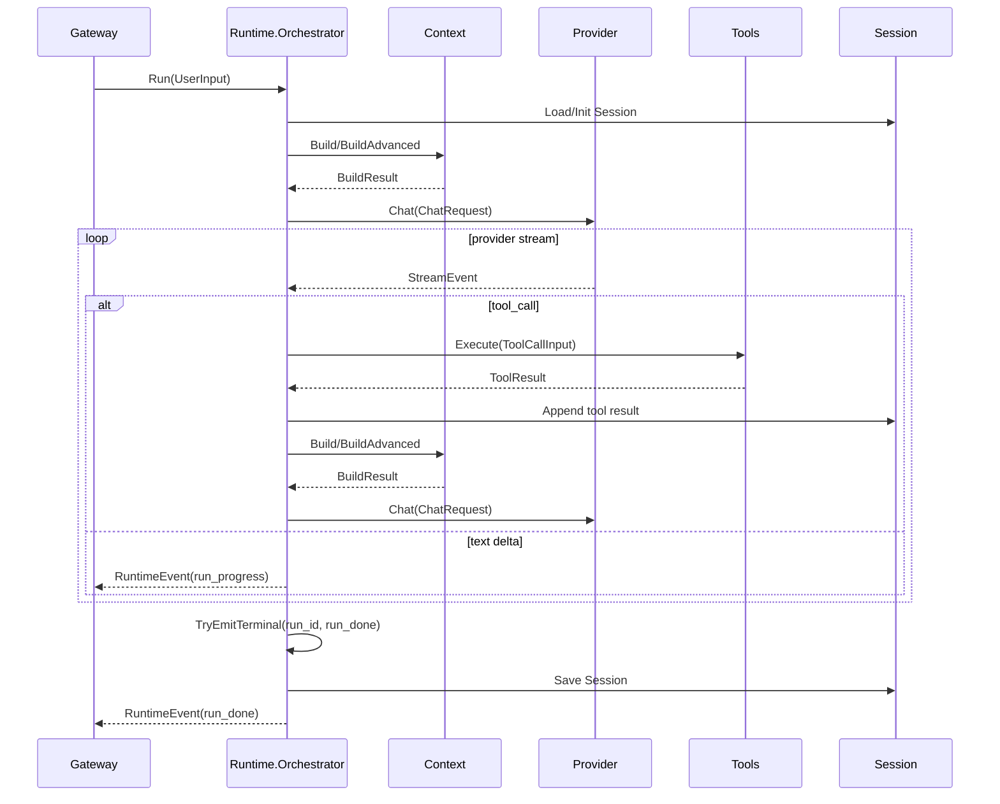
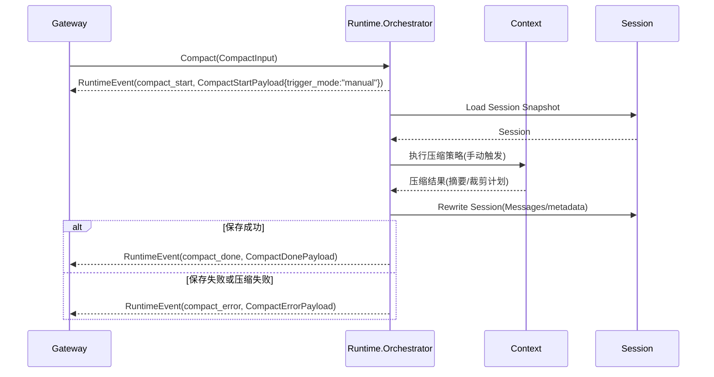
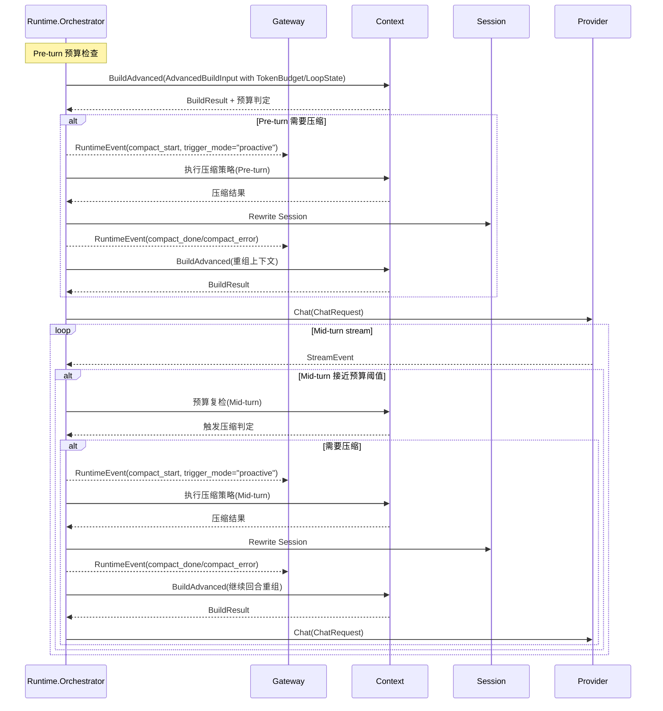
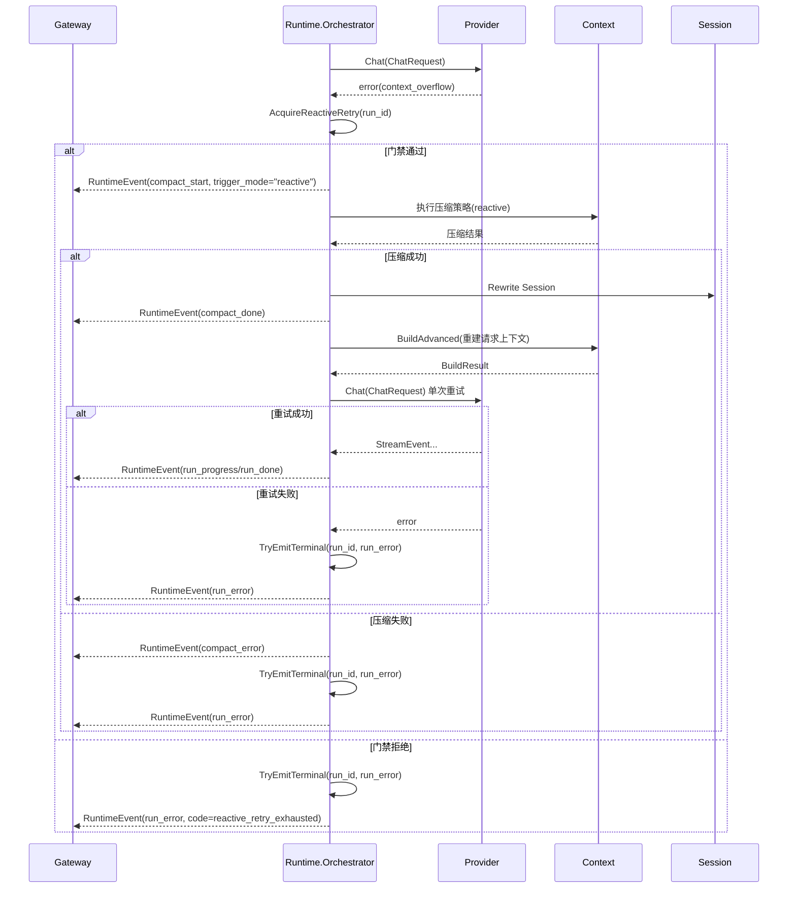
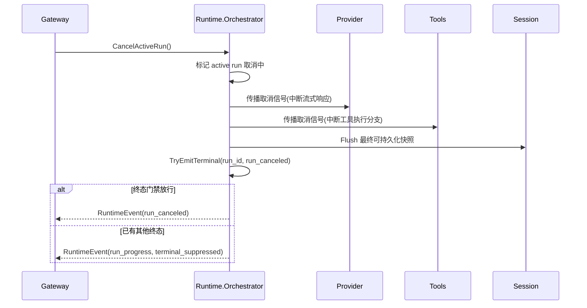
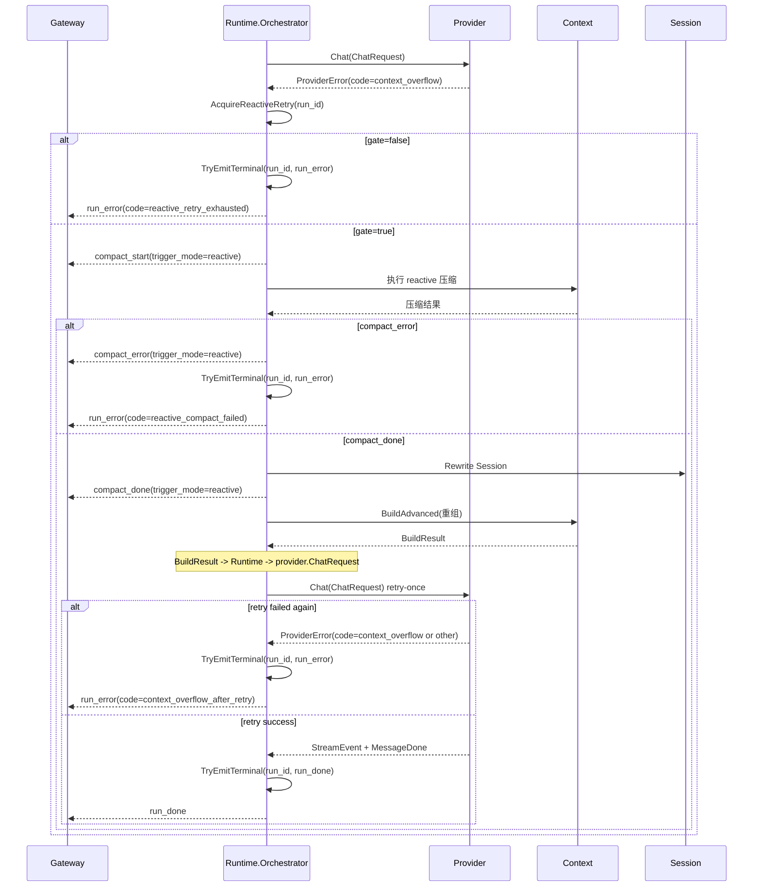

# Runtime 模块设计与接口文档

> 文档版本：v3.1
> 文档定位：详细设计文档（LLD）+ 接口文档（API/Contract）

## 规范词约定

- `MUST`：必须满足的架构契约，违反会破坏编排稳定性与联调一致性。
- `SHOULD`：强烈建议遵循，若例外必须记录原因。
- `MAY`：可选增强能力。

## 1. 详细设计（LLD）

### 1.1 目的与范围

Runtime 模块是编排中枢，负责把一次用户输入推进到唯一终态，并协调 Context、Provider、Tools、Session、Config。

Runtime 模块 MUST 覆盖：

- 回合编排与停止条件控制。
- 事件流统一发布。
- 手动压缩、主动压缩与溢出恢复门禁。
- 会话加载、列表、工作目录映射。

Runtime 模块 MUST NOT 覆盖：

- 模型协议适配（由 Provider 负责）。
- 工具执行实现（由 Tools 负责）。
- 配置存储实现（由 Config 负责）。

### 1.2 架构链路定位

- Runtime 的直接上游是 Gateway。
- Runtime 分别直接调用 Context 与 Provider。
- Runtime 负责把 Context 输出映射为 Provider 请求，并统一调度 Tools/Session/Config。

### 1.3 模块边界

- 上游：Gateway。
- 下游：Context、Provider、Tools、Session、Config。
- 边界约束：上游不得直连 Provider/Tools/Session；Context 不得直连 Provider。

### 1.4 核心流程

#### 1.4.1 Run 主循环



#### 1.4.2 Compact 流程（全链路）

##### 1.4.2.1 Manual Compact（独立操作）



Manual Compact MUST 作为独立操作完成，不强制触发新一轮模型生成。

##### 1.4.2.2 In-Run Proactive Compact（Pre-turn + Mid-turn）



##### 1.4.2.3 Reactive Compact（溢出恢复）



#### 1.4.3 Cancel 流程（传播式取消）



#### 1.4.4 Reactive 恢复流程（错误识别 + 门禁 + 恢复 + 单次重试）



### 1.5 时序图约束说明

- 参与者集合 MUST 统一使用：Gateway、Runtime.Orchestrator、Context、Provider、Tools、Session。
- 调用链 MUST 表述为 `Runtime -> Context` 与 `Runtime -> Provider`，禁止写成 `Context -> Provider` 直接调用。
- 数据映射链 MUST 显式体现 `context.BuildResult -> Runtime -> provider.ChatRequest`。
- `TryEmitTerminal` 与 `AcquireReactiveRetry` MUST 体现在 Cancel/Reactive 的关键路径。
- 事件负载 SHOULD 包含可观测字段（如 `run_id`、`session_id`、`trigger_mode`、`code`）。
- 诊断增强事件 MAY 增加，但不得改变既有终态语义。

### 1.6 终态与门禁约束

- 每个 `run_id` MUST 仅允许一个终态事件。
- 终态门禁 MUST 保证并发竞争下仍保持唯一终态。
- reactive 自动重试 MUST 受单次门禁控制，禁止无限重试。

### 1.7 非功能约束

- 可观测性：关键阶段事件 MUST 可追踪。
- 并发性：`Run` 与 `Compact` SHOULD 串行化，避免会话并发改写。
- 稳定性：事件顺序 SHOULD 可复现，终态优先级 MUST 明确。

## 2. 接口文档（API/Contract）

### 2.1 公共规范

- 所有编排入口 MUST 接收 `context.Context`。
- 事件输出 MUST 统一由 `Events()` 通道发布。
- 错误 MUST 通过 `error` 与事件负载协同表达。

### 2.2 主接口目录

| 接口 | 职责 |
|---|---|
| `Orchestrator` | 编排主契约（运行、压缩、取消、事件、会话管理、门禁能力） |

### 2.3 关键类型目录

| 类型 | 说明 |
|---|---|
| `UserInput` | 运行输入 |
| `CompactInput` / `CompactResult` | 压缩输入输出 |
| `RuntimeEvent` | 统一事件信封 |
| `Session` / `SessionSummary` | 会话视图 |
| `PermissionRequestPayload` / `PermissionResolvedPayload` | 审批事件负载 |
| `CompactStartPayload` / `CompactDonePayload` / `CompactErrorPayload` | 压缩事件负载 |

### 2.4 跨层契约绑定

| 链路 | 输入契约 | 输出契约 | 说明 |
|---|---|---|---|
| `Gateway -> Runtime` | `runtime.UserInput` / `runtime.CompactInput` | `runtime.RuntimeEvent` | 网关将用户操作映射为编排命令 |
| `Runtime -> Context` | `context.BuildInput` / `context.AdvancedBuildInput` | `context.BuildResult` | 上下文构建与重组 |
| `Runtime -> Provider` | `provider.ChatRequest` | `provider.StreamEvent` | 模型调用与流式消费 |
| `Runtime -> Tools` | `tools.ToolCallInput` | `tools.ToolResult` | 工具执行与回灌 |
| `Runtime <-> Session` | `session.Store` | `session.Session` / `session.SessionSummary` | 会话持久化与恢复 |
| `Runtime <-> Config` | `config.Registry` | `config.Config` | 配置快照与更新 |

### 2.5 JSON 示例

#### 2.5.1 运行进行中事件示例

```json
{
  "type": "run_progress",
  "run_id": "run_123",
  "session_id": "sess_abc",
  "payload": {
    "stage": "provider_stream",
    "message": "receiving text delta"
  }
}
```

#### 2.5.2 compact 成功示例

```json
{
  "type": "compact_done",
  "run_id": "run_123",
  "session_id": "sess_abc",
  "payload": {
    "trigger_mode": "manual",
    "applied": true,
    "before_chars": 100000,
    "after_chars": 25000,
    "saved_ratio": 0.75
  }
}
```

#### 2.5.3 审批事件示例

```json
{"type":"permission_request","payload":{"tool_name":"bash","reason":"write access required"}}
{"type":"permission_resolved","payload":{"tool_name":"bash","decision":"approved"}}
```

#### 2.5.4 Reactive 门禁拒绝示例

```json
{
  "type": "run_error",
  "run_id": "run_123",
  "session_id": "sess_abc",
  "payload": {
    "code": "reactive_retry_exhausted",
    "message": "reactive retry gate exhausted for run_123"
  }
}
```

#### 2.5.5 Reactive 压缩失败示例

```json
{
  "type": "run_error",
  "run_id": "run_123",
  "session_id": "sess_abc",
  "payload": {
    "code": "reactive_compact_failed",
    "message": "reactive compact failed"
  }
}
```

#### 2.5.6 Reactive 重试后仍失败示例

```json
{
  "type": "run_error",
  "run_id": "run_123",
  "session_id": "sess_abc",
  "payload": {
    "code": "context_overflow_after_retry",
    "message": "context overflow persists after reactive retry"
  }
}
```

### 2.6 旧命名迁移说明

| 旧契约 | 新契约 |
|---|---|
| `Runtime` | `Orchestrator` |
| `TerminalEventGate` | 并入 `Orchestrator.TryEmitTerminal` |
| `ReactiveRetryGate` | 并入 `Orchestrator.AcquireReactiveRetry` |

### 2.7 变更规则

- 新增事件字段 MUST 向后兼容。
- 主接口方法改动 MUST 经过版本化流程并提供迁移窗口。
- 门禁相关语义调整 SHOULD 保持错误码稳定。

## 3. 评审检查清单

- 是否明确 `Orchestrator` 为唯一主契约锚点。
- 是否包含 Run/Compact/Cancel/Reactive 的全链路时序图。
- 是否明确 `Runtime -> Context` 与 `Runtime -> Provider` 为并行直接调用，且无 `Context -> Provider` 直连语义。
- 是否包含成功与失败 JSON 示例（含 reactive 三类失败路径）。
- 是否明确终态唯一性与重试门禁语义。
- 文档类型名是否与 `runtime/interface.go` 一致。
