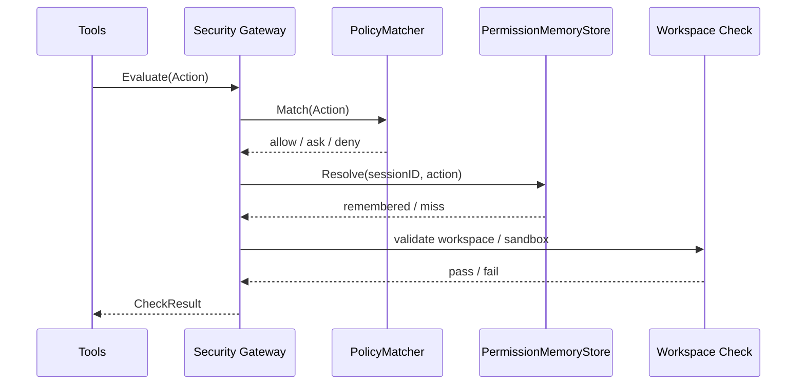
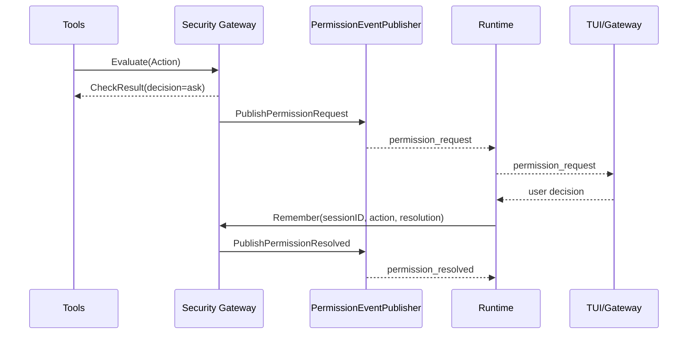

# Security 模块设计与接口文档

> 文档版本：v1.0
> 文档定位：详细设计文档（LLD）+ 接口文档（API/Contract）

## 规范词约定

- `MUST`：必须满足的架构契约，违反会破坏权限治理闭环与执行安全。
- `SHOULD`：强烈建议遵循，若例外必须记录原因。
- `MAY`：可选增强能力。

## 1. 详细设计（LLD）

### 1.1 目的与范围

Security 模块是 Tools / Runtime 之间的统一安全治理边界，负责权限策略命中、审批事件透传、session 级记忆与工作区边界复核。

Security 模块 MUST 覆盖：

- 动作抽象与统一权限输入。
- allow / ask / deny 策略命中。
- session 级 `once / always_session / reject_session` 记忆。
- `PermissionRequest / PermissionResolved` 事件发布。
- 工作区与 sandbox 复核。

Security 模块 MUST NOT 覆盖：

- 具体工具执行（由 Tools 负责）。
- 主循环控制（由 Runtime 负责）。
- TUI 审批交互界面实现（由 TUI / Gateway 负责）。

### 1.2 架构链路定位

- Security 的直接上游 SHOULD 是 Tools，Runtime 在 ask 闭环中参与审批回传。
- Client 不得直接调用 Security 判定能力。
- 单入口链路中关键路径为 `Runtime -> Tools -> Security -> Tools -> Runtime`。

### 1.3 模块边界

- 上游：Tools、Runtime。
- 下游：静态策略规则、session 记忆存储、工作区边界校验。
- 边界约束：Security 仅返回 `CheckResult` 与审批事件，不负责直接执行工具。
- 边界约束：Security 不得感知 Provider 协议细节。

### 1.4 权限判定流程（当前/目标共性）



### 1.5 ask 审批闭环（目标态）



### 1.6 核心语义

- `allow`：允许直接执行。
- `deny`：阻断执行，并返回稳定错误语义。
- `ask`：要求上游发起显式审批闭环。
- `once`：仅当前一次请求生效。
- `always_session`：当前 session 内同范围请求持续放行。
- `reject_session`：当前 session 内同范围请求持续拒绝。

### 1.7 非功能约束

- 安全性：硬性 deny 规则 MUST 不被宽泛的 session allow 记忆绕过。
- 一致性：审批事件字段 SHOULD 可观测、可回放、可用于 UI 展示。
- 可替换性：策略命中、session 存储、事件发布 SHOULD 通过接口解耦。
- 可扩展性：未来 bash / filesystem / webfetch / MCP 的命中策略 SHOULD 共享统一 Action 模型。

## 2. 接口文档（API/Contract）

### 2.1 公共规范

- 所有判定方法 MUST 接收 `context.Context`。
- Security 对外 SHOULD 通过 `Action -> CheckResult` 建模。
- ask 场景 MUST 可序列化为稳定事件与审批决议结构。

### 2.2 接口目录

| 接口 | 职责 |
|---|---|
| `PolicyMatcher` | 命中策略层 |
| `PermissionMemoryStore` | session 级记忆层 |
| `PermissionEventPublisher` | 审批事件透传层 |
| `ToolSecurityGateway` | 统一安全网关 |

### 2.3 关键类型目录

| 类型 | 说明 |
|---|---|
| `Action` | 统一安全输入 |
| `ActionPayload` | 权限检查上下文 |
| `Rule` | 静态策略规则 |
| `Decision` | allow / ask / deny |
| `CheckResult` | 判定结果 |
| `PermissionRequest` | 审批请求事件负载 |
| `PermissionResolved` | 审批完成事件负载 |
| `PermissionResolution` | 上游回写的审批决议 |

### 2.4 跨层契约绑定

| 链路 | 输入契约 | 输出契约 | 说明 |
|---|---|---|---|
| `Tools -> Security` | `security.Action` | `security.CheckResult` | 工具执行前权限判定 |
| `Runtime -> Security` | `security.PermissionResolution` | `PermissionResolved` 事件 | 审批结果回写与记忆更新 |
| `Security -> Runtime/TUI` | `PermissionRequest` / `PermissionResolved` | 运行时事件 | ask 闭环可观测化 |

### 2.5 JSON 示例

#### 2.5.1 Action 示例

```json
{
  "type": "read",
  "payload": {
    "tool_name": "read_file",
    "resource": "filesystem_read",
    "operation": "read",
    "session_id": "sess_123",
    "workdir": "C:/workspace/demo",
    "target_type": "path",
    "target": "README.md"
  }
}
```

#### 2.5.2 CheckResult 示例

```json
{
  "decision": "ask",
  "reason": "reading target outside current trusted scope",
  "rule": {
    "id": "ask-filesystem-outside-workspace",
    "resource": "filesystem_read"
  }
}
```

#### 2.5.3 PermissionResolution 示例

```json
{
  "request_id": "perm_001",
  "allowed": true,
  "reason": "user approved in tui",
  "scope": "always_session"
}
```

### 2.6 变更规则

- 新增策略字段 MUST 向后兼容。
- 记忆范围新增 SHOULD 通过扩展枚举，不复用已有语义。
- ask 相关事件字段调整 MUST 保持上游可判定性。

## 3. 评审检查清单

- 是否把权限判定、审批事件、session 记忆拆成独立职责。
- 是否明确 Security 不直接执行工具。
- 是否明确 ask 闭环与 session remember 的目标语义。
- 是否为 Tools / Runtime 提供稳定契约，而不是暴露内部规则实现。
- 是否与 `security/interface.go` 类型名一致。
