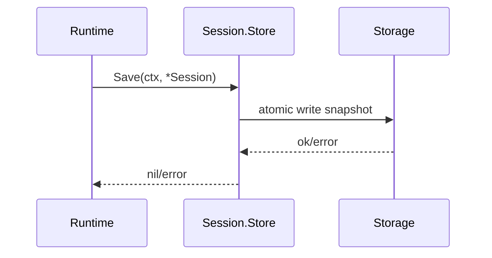
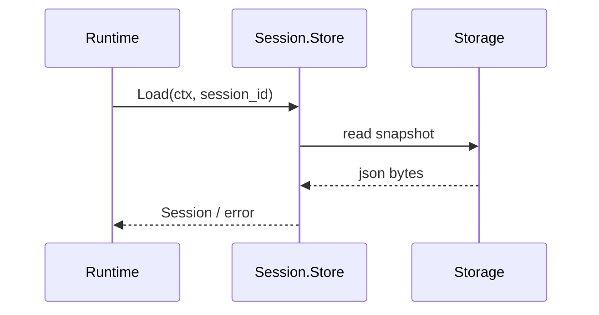
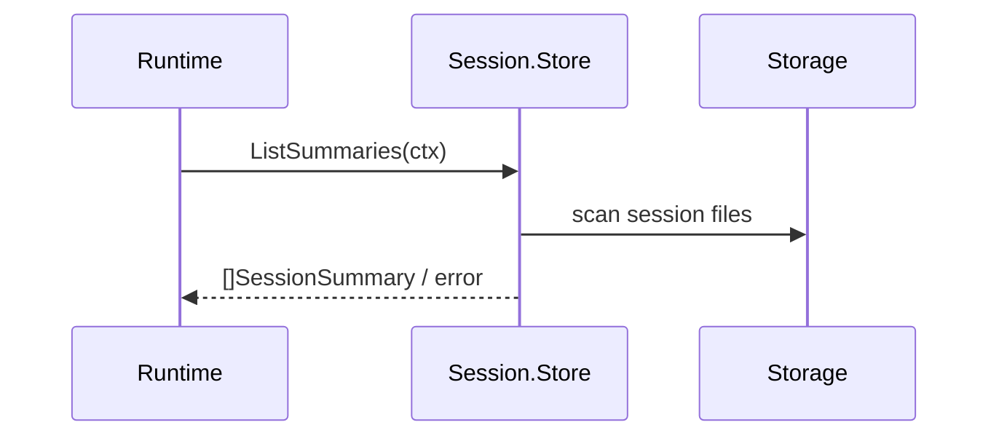

# Session 模块设计与接口文档

> 文档版本：v2.0
> 文档定位：详细设计文档（LLD）+ 接口文档（API/Contract）

## 规范词约定

- `MUST`：必须满足的架构契约。
- `SHOULD`：强烈建议遵循，若例外必须记录原因。
- `MAY`：可选增强能力。

## 1. 详细设计（LLD）

### 1.1 目的与范围

Session 模块定义会话持久化边界，负责快照保存、会话恢复、摘要查询与可选运行态扩展存储。

Session 模块 MUST 覆盖：

- 会话完整快照写入。
- 会话按标识加载。
- 会话摘要列表查询。

Session 模块 MUST NOT 覆盖：

- 主循环编排决策（由 Runtime 负责）。
- 上下文组装与压缩策略（由 Context 负责）。
- 模型调用与协议处理（由 Provider 负责）。

### 1.2 架构链路定位

- Session 的直接调用方 MUST 是 Runtime。
- Client 不得直接读写 Session 存储。
- 在系统单入口模型中，路径为 `Client -> Gateway -> Runtime <-> Session`。

### 1.3 模块边界

- 上游：Runtime。
- 下游：文件存储或其他可插拔存储后端。
- 边界约束：Session 仅负责存储语义，不持有编排逻辑。

### 1.4 核心流程

#### 1.4.1 Save 流程



#### 1.4.2 Load 流程



#### 1.4.3 List 流程



### 1.5 一致性与并发语义

- 同一会话写入 SHOULD 串行化，避免覆盖冲突。
- 多会话并发读取 MUST 线程安全。
- 快照写入 SHOULD 具备原子性与完整性保障。

### 1.6 非功能约束

- 可观测性：Session 错误 SHOULD 可被 Runtime 统一记录。
- 可恢复性：读取失败 MUST 保持错误可诊断，不得吞错。
- 可扩展性：扩展接口 MUST 不破坏 `Store` 基础签名。

## 2. 接口文档（API/Contract）

### 2.1 公共规范

- 所有方法 MUST 接收 `context.Context`。
- 会话写入 MUST 以完整快照为单位。
- 错误 MUST 原样返回，由 Runtime 决策后续动作。

### 2.2 接口目录

| 接口 | 职责 |
|---|---|
| `Store` | 快照保存、会话加载、摘要查询 |
| `SessionRuntimeStateStore` | 运行态快照保存与恢复 |
| `ArchiveStore` | 会话归档扩展 |

### 2.3 关键类型目录

| 类型 | 说明 |
|---|---|
| `Session` | 完整会话快照 |
| `SessionSummary` | 会话摘要视图 |
| `RuntimeState` | 运行态扩展快照 |

### 2.4 跨层契约绑定

| 链路 | 输入契约 | 输出契约 | 说明 |
|---|---|---|---|
| `Runtime -> Session`（保存） | `session.Session` | `error` | 回合关键节点落盘 |
| `Runtime -> Session`（加载） | `session.Store.Load(id)` | `session.Session` | 会话恢复 |
| `Runtime -> Session`（列表） | `session.Store.ListSummaries()` | `[]session.SessionSummary` | 会话导航数据 |

### 2.5 JSON 示例

#### 2.5.1 Session 快照示例

```json
{
  "id": "sess_123",
  "title": "修复 provider 超时",
  "provider": "openai",
  "model": "gpt-4.1",
  "workdir": "C:/workspace/demo",
  "messages": [
    {"role": "user", "parts": [{"type": "text", "text": "帮我排查超时问题"}]}
  ]
}
```

#### 2.5.2 摘要列表示例

```json
[
  {
    "id": "sess_123",
    "title": "修复 provider 超时",
    "created_at": "2026-04-07T10:20:30Z",
    "updated_at": "2026-04-07T11:02:15Z"
  }
]
```

#### 2.5.3 失败示例

```json
{
  "code": "session_store_write_failed",
  "message": "atomic rename failed: access denied"
}
```

### 2.6 变更规则

- 字段新增 MUST 保持向后兼容。
- 字段改名/删除 MUST 经过版本化流程并提供迁移窗口。
- 扩展接口 SHOULD 通过新增接口演进，不破坏 `Store` 稳定签名。

## 3. 评审检查清单

- 是否包含 Save/Load/List 全流程说明。
- 是否明确 Runtime 为唯一直接调用方。
- 是否提供成功与失败 JSON 示例。
- 是否定义并发与一致性语义。
- 是否与 `session/interface.go` 类型名完全一致。
