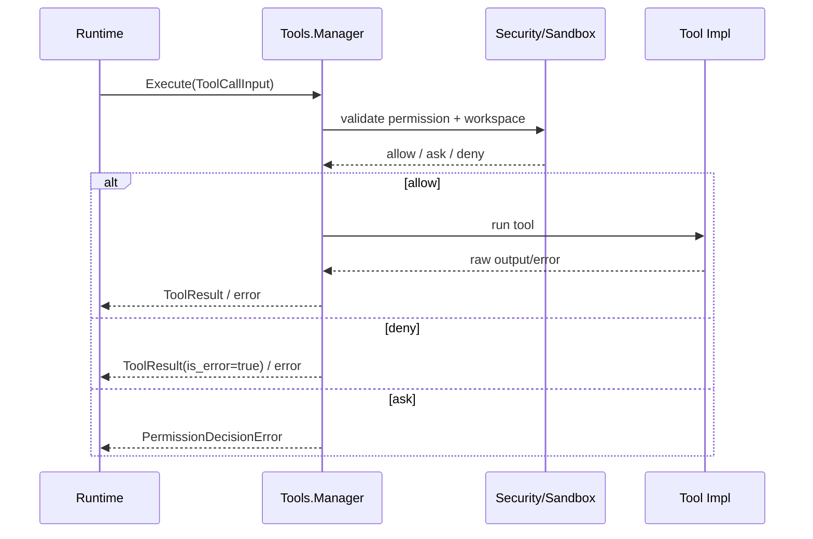
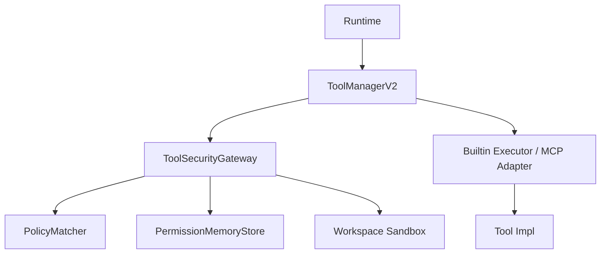
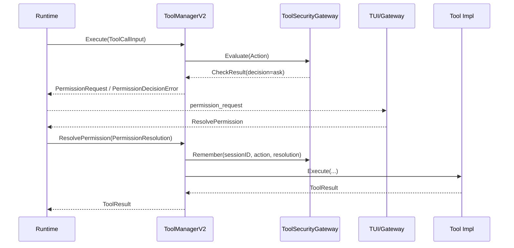

# Tools 模块设计与接口文档

> 文档版本：v3.1
> 文档定位：详细设计文档（LLD）+ 接口文档（API/Contract）

## 规范词约定

- `MUST`：必须满足的架构契约，违反会破坏执行安全与联调稳定性。
- `SHOULD`：强烈建议遵循，若例外必须记录原因。
- `MAY`：可选增强能力。

## 1. 详细设计（LLD）

### 1.1 目的与范围

Tools 模块是 Runtime 的统一工具执行边界，负责工具能力暴露、参数承载、安全协作、执行管线与结果归一。

Tools 模块 MUST 覆盖：

- 工具清单暴露。
- 工具参数与执行上下文承载。
- 与 Security 协作完成权限判定、审批回写、工作区约束。
- 工具执行分发、输出收敛与错误归一。
- 对 MCP 工具与内置工具提供统一接入门面。

Tools 模块 MUST NOT 覆盖：

- 模型请求发送（由 Provider 负责）。
- 会话持久化（由 Session 负责）。
- 主循环编排决策（由 Runtime 负责）。
- 安全策略命中规则定义本身（由 Security 负责）。

### 1.2 架构链路定位

- Tools 的直接调用方 MUST 是 Runtime。
- Client 不得直接调用工具执行。
- 单入口链路中路径为 `Client -> Gateway -> Runtime -> Tools`。
- Security MUST 作为 Tools 的下游协作模块参与审批与边界复核。

### 1.3 模块边界

- 上游：Runtime。
- 下游：具体工具实现、Security、MCP 适配层、沙箱组件。
- 边界约束：Tools 仅输出 `ToolResult` 与执行错误，不输出模型协议字段。
- 边界约束：具体工具实现不得自行维护审批状态，审批记忆 MUST 通过统一门面收敛。

### 1.4 工具执行管线（当前实现）



### 1.5 Tool / Security 协作分层（目标态）



- Tools 层负责统一入口、执行分发、结果归一。
- Security 层负责策略命中、审批事件、session 记忆、工作区复核。
- MCP 接入 SHOULD 在 Tools 层完成统一注册与能力映射，不向 Runtime 暴露额外分支逻辑。

### 1.6 审批闭环语义

- 审批流程 MUST 具备请求、决策、结果三段语义。
- 审批相关事件 SHOULD 包含可观测字段：`tool_name`、`session_id`、`decision`、`reason`。
- 未通过审批的执行 MUST 被阻断并返回可判定错误语义。
- ask 场景 SHOULD 形成 `permission_request -> 用户决策 -> resolve -> continue` 完整闭环。
- session 级授权 SHOULD 支持 `once / always_session / reject_session` 三种记忆范围。

#### 1.6.1 ask 闭环时序（目标态）



### 1.7 非功能约束

- 安全性：执行 MUST 受工作区限制与权限策略约束。
- 稳定性：工具输出 SHOULD 做长度控制与结构收敛，避免上下文爆炸。
- 可观测性：关键执行阶段 SHOULD 可追踪。
- 可扩展性：内置工具与 MCP 工具 SHOULD 通过统一 `ToolSpec / ToolCallInput / ToolResult` 收敛。

## 2. 接口文档（API/Contract）

### 2.1 公共规范

- 所有方法 MUST 接收 `context.Context`。
- `Execute` MUST 使用 `ToolCallInput` 作为统一输入。
- 业务失败 SHOULD 通过 `ToolResult.IsError` 表达，系统失败通过 `error` 返回。
- 流式工具 SHOULD 通过 `ChunkEmitter` 向上游发送 chunk，并允许回调显式中止执行。

### 2.2 接口目录

| 接口 | 职责 |
|---|---|
| `Manager` | 当前工具能力列举与工具执行门面 |
| `ToolSecurityGateway` | 统一安全入口（目标态） |
| `PermissionMemoryStore` | session 级权限记忆（目标态） |
| `MCPRegistryAdapter` | MCP server 注册与工具发现（目标态） |
| `SubAgentOrchestrator` | 子任务隔离执行扩展 |

### 2.3 关键类型目录

| 类型 | 说明 |
|---|---|
| `ToolSpec` | 工具描述 |
| `SpecListInput` | 能力查询输入 |
| `ToolCallInput` | 工具执行输入 |
| `ToolResult` | 工具执行结果 |
| `WorkspaceExecutionPlan` | 工作区约束计划 |
| `PermissionResolution` | 审批决议（目标态） |
| `PermissionRememberScope` | session 级审批记忆范围（目标态） |

### 2.4 跨层契约绑定

| 链路 | 输入契约 | 输出契约 | 说明 |
|---|---|---|---|
| `Runtime -> Tools`（能力列举） | `tools.SpecListInput` | `[]tools.ToolSpec` | 模型调用前注入工具清单 |
| `Runtime -> Tools`（执行） | `tools.ToolCallInput` | `tools.ToolResult` | 工具执行并回灌结果 |
| `Tools -> Security`（当前/目标） | `security.Action` / `PermissionResolution` | `security.CheckResult` | 权限判定、审批回写、session 记忆 |
| `Tools -> MCP`（目标） | `server_id + source` | `[]tools.ToolSpec` | 动态注册远端工具并统一暴露 |

### 2.5 JSON 示例

#### 2.5.1 ToolCallInput 示例

```json
{
  "id": "call_001",
  "name": "read_file",
  "arguments": "{\"path\":\"README.md\"}",
  "session_id": "sess_123",
  "workdir": "C:/workspace/demo"
}
```

#### 2.5.2 ToolResult 示例

```json
{
  "tool_call_id": "call_001",
  "name": "read_file",
  "content": "# Project README...",
  "is_error": false,
  "metadata": {
    "truncated": false
  }
}
```

#### 2.5.3 审批事件示例

```json
{"type":"permission_request","payload":{"tool_name":"bash","session_id":"sess_123","reason":"write access required"}}
{"type":"permission_resolved","payload":{"tool_name":"bash","session_id":"sess_123","decision":"approved"}}
```

#### 2.5.4 PermissionResolution 示例（目标态）

```json
{
  "request_id": "perm_001",
  "allowed": true,
  "reason": "user approved in tui",
  "scope": "always_session"
}
```

#### 2.5.5 失败示例

```json
{
  "code": "tool_access_denied",
  "message": "workspace root violation: path outside allowed roots"
}
```

### 2.6 变更规则

- 新增字段 MUST 保持向后兼容。
- 字段改名/删除 MUST 经过版本化流程并提供迁移窗口。
- 扩展能力 SHOULD 通过新增字段或新增接口演进，不破坏 `Manager` 稳定签名。
- Security 相关增强 SHOULD 优先新增辅助接口，不直接把策略细节泄漏到具体 Tool 实现。

## 3. 评审检查清单

- 是否提供能力列举与执行两条链路的完整说明。
- 是否明确 Runtime 为唯一直接调用方。
- 是否包含审批语义与失败示例。
- 是否定义安全约束与输出收敛约束。
- 是否与 `tools/interface.go` 类型名一致。
- 是否明确 Tools 与 Security 的边界，而不是把权限策略写死在具体工具实现中。
