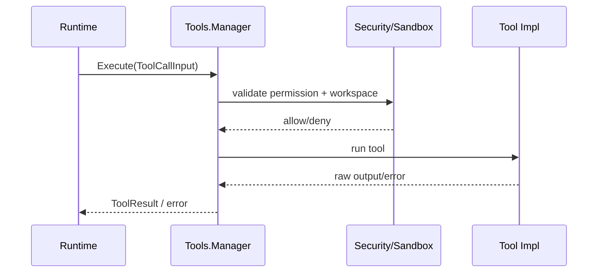

# Tools 模块设计与接口文档

> 文档版本：v3.0
> 文档定位：详细设计文档（LLD）+ 接口文档（API/Contract）

## 规范词约定

- `MUST`：必须满足的架构契约，违反会破坏执行安全与联调稳定性。
- `SHOULD`：强烈建议遵循，若例外必须记录原因。
- `MAY`：可选增强能力。

## 1. 详细设计（LLD）

### 1.1 目的与范围

Tools 模块是 Runtime 的统一工具执行边界，负责工具能力暴露、参数承载、安全校验、执行管线与结果归一。

Tools 模块 MUST 覆盖：

- 工具清单暴露。
- 工具参数与执行上下文承载。
- 权限与工作区沙箱校验。
- 工具输出收敛与错误归一。

Tools 模块 MUST NOT 覆盖：

- 模型请求发送（由 Provider 负责）。
- 会话持久化（由 Session 负责）。
- 主循环编排决策（由 Runtime 负责）。

### 1.2 架构链路定位

- Tools 的直接调用方 MUST 是 Runtime。
- Client 不得直接调用工具执行。
- 单入口链路中路径为 `Client -> Gateway -> Runtime -> Tools`。

### 1.3 模块边界

- 上游：Runtime。
- 下游：具体工具实现、权限组件、沙箱组件。
- 边界约束：Tools 仅输出 `ToolResult` 与执行错误，不输出模型协议字段。

### 1.4 工具执行管线



### 1.5 审批闭环语义

- 审批流程 MUST 具备请求、决策、结果三段语义。
- 审批相关事件 SHOULD 包含可观测字段：`tool_name`、`session_id`、`decision`、`reason`。
- 未通过审批的执行 MUST 被阻断并返回可判定错误语义。

### 1.6 非功能约束

- 安全性：执行 MUST 受工作区限制与权限策略约束。
- 稳定性：工具输出 SHOULD 做长度控制与结构收敛，避免上下文爆炸。
- 可观测性：关键执行阶段 SHOULD 可追踪。

## 2. 接口文档（API/Contract）

### 2.1 公共规范

- 所有方法 MUST 接收 `context.Context`。
- `Execute` MUST 使用 `ToolCallInput` 作为统一输入。
- 业务失败 SHOULD 通过 `ToolResult.IsError` 表达，系统失败通过 `error` 返回。

### 2.2 接口目录

| 接口 | 职责 |
|---|---|
| `Manager` | 工具能力列举与工具执行 |
| `SubAgentOrchestrator` | 子任务隔离执行扩展 |

### 2.3 关键类型目录

| 类型 | 说明 |
|---|---|
| `ToolSpec` | 工具描述 |
| `SpecListInput` | 能力查询输入 |
| `ToolCallInput` | 工具执行输入 |
| `ToolResult` | 工具执行结果 |
| `WorkspaceExecutionPlan` | 工作区约束计划 |

### 2.4 跨层契约绑定

| 链路 | 输入契约 | 输出契约 | 说明 |
|---|---|---|---|
| `Runtime -> Tools`（能力列举） | `tools.SpecListInput` | `[]tools.ToolSpec` | 模型调用前注入工具清单 |
| `Runtime -> Tools`（执行） | `tools.ToolCallInput` | `tools.ToolResult` | 工具执行并回灌结果 |

### 2.5 JSON 示例

#### 2.5.1 ToolCallInput 示例

```json
{
  "id": "call_001",
  "name": "read_file",
  "arguments": "{\"path\":\"README.md\"}",
  "session_id": "sess_123",
  "workdir": "C:/workspace/demo"
}
```

#### 2.5.2 ToolResult 示例

```json
{
  "tool_call_id": "call_001",
  "name": "read_file",
  "content": "# Project README...",
  "is_error": false,
  "metadata": {
    "truncated": false
  }
}
```

#### 2.5.3 审批事件示例

```json
{"type":"permission_request","payload":{"tool_name":"bash","session_id":"sess_123","reason":"write access required"}}
{"type":"permission_resolved","payload":{"tool_name":"bash","session_id":"sess_123","decision":"approved"}}
```

#### 2.5.4 失败示例

```json
{
  "code": "tool_access_denied",
  "message": "workspace root violation: path outside allowed roots"
}
```

### 2.6 变更规则

- 新增字段 MUST 保持向后兼容。
- 字段改名/删除 MUST 经过版本化流程并提供迁移窗口。
- 扩展能力 SHOULD 通过新增字段或新增接口演进，不破坏 `Manager` 稳定签名。

## 3. 评审检查清单

- 是否提供能力列举与执行两条链路的完整说明。
- 是否明确 Runtime 为唯一直接调用方。
- 是否包含审批语义与失败示例。
- 是否定义安全约束与输出收敛约束。
- 是否与 `tools/interface.go` 类型名一致。
