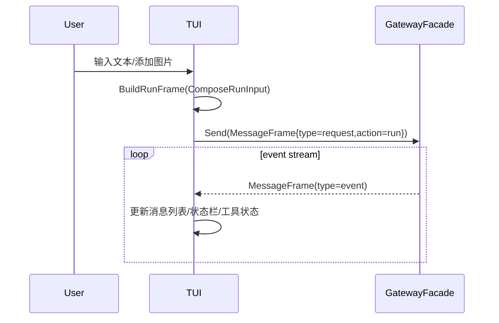
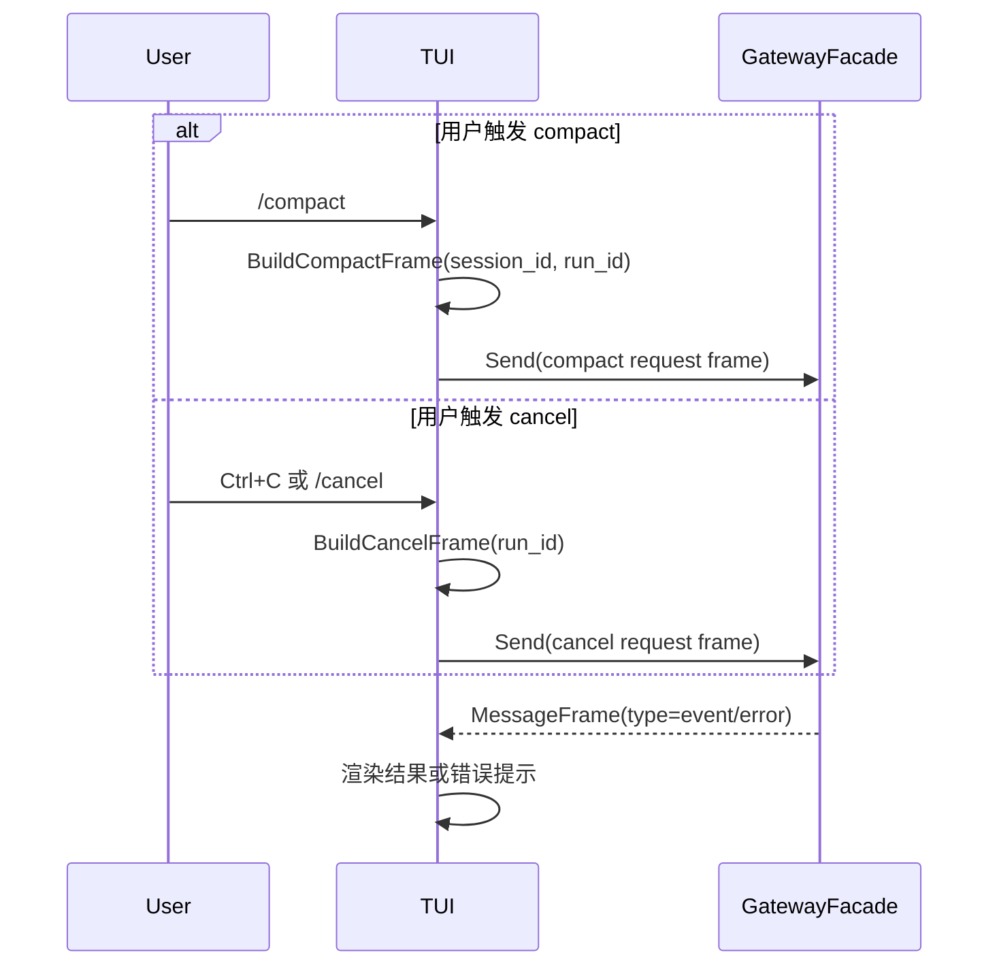

# TUI 模块设计与接口文档

> 文档版本：v3.0
> 文档定位：详细设计文档（LLD）+ 接口文档（API/Contract）

## 规范词约定

- `MUST`：必须满足的架构契约，违反会导致交互链路与协议语义失真。
- `SHOULD`：强烈建议遵循，若例外必须记录原因。
- `MAY`：可选增强能力。

## 1. 详细设计（LLD）

### 1.1 目的与范围

TUI 模块负责终端交互与渲染，并通过 Gateway 完成请求发送与事件消费。

TUI 模块 MUST 覆盖：

- 输入采集与视图状态管理。
- 请求帧组装（run/compact/cancel）。
- 事件帧消费与渲染更新。
- 多模态输入组装（文本 + 附件）。

TUI 模块 MUST NOT 覆盖：

- 运行时编排与终态门禁。
- 模型调用、工具执行、会话持久化。

### 1.2 架构边界

- 上游：用户键盘输入、附件选择、快捷命令。
- 下游：`GatewayFacade`。
- 边界约束：TUI 不直连 Runtime，不直接依赖 runtime 输入/事件类型。

### 1.3 核心流程

#### 1.3.1 发送运行请求并接收事件



#### 1.3.2 Compact 与 Cancel 请求流程



### 1.4 多模态输入约束

- TUI MUST 支持 `input_text` 与 `input_parts` 的联合提交。
- `input_parts` MUST 使用 `provider.MessagePart` 语义，包含文本片段与图片等非文本媒体。
- 当附件不合法时，TUI SHOULD 在本地预校验失败并提示，不应发送无效帧。

### 1.5 非功能约束

- 响应性：输入与事件渲染 SHOULD 保持低延迟。
- 稳定性：帧解码失败 MUST 走统一错误展示路径。
- 可观测性：SHOULD 在界面层展示 `run_id/session_id` 便于排障。

## 2. 接口文档（API/Contract）

### 2.1 公共规范

- 主契约 MUST 为 `tui.TUI`。
- 下游依赖 MUST 为 `tui.GatewayFacade`。
- 交互输入输出 MUST 通过 `gateway.MessageFrame` 承载。

### 2.2 接口目录

| 接口 | 职责 |
|---|---|
| `TUI` | TUI 主契约（主循环 + 帧组装） |
| `GatewayFacade` | 网关门面契约（发送帧 + 事件流 + 关闭） |

### 2.3 关键类型目录

| 类型 | 说明 |
|---|---|
| `ComposeRunInput` | 运行请求组装输入 |
| `gateway.MessageFrame` | 协议请求/事件/错误帧 |
| `provider.MessagePart` | 多模态输入分片语义 |

### 2.4 JSON 示例

#### 2.4.1 多模态 run 请求帧示例

```json
{
  "type": "request",
  "action": "run",
  "session_id": "sess_abc",
  "input_text": "请识别这张图里的报错",
  "input_parts": [
    {"type": "text", "text": "先提取图片中的关键日志"},
    {
      "type": "image",
      "media": {
        "uri": "file:///workspace/screenshots/error.png",
        "mime_type": "image/png",
        "file_name": "error.png"
      }
    }
  ],
  "workdir": "/workspace/project"
}
```

#### 2.4.2 compact 请求帧示例

```json
{
  "type": "request",
  "action": "compact",
  "run_id": "run_123",
  "session_id": "sess_abc"
}
```

#### 2.4.3 事件帧示例

```json
{
  "type": "event",
  "action": "run",
  "run_id": "run_123",
  "session_id": "sess_abc",
  "payload": {
    "event_type": "run_progress",
    "message": "executing tool: read_file"
  }
}
```

#### 2.4.4 错误帧示例

```json
{
  "type": "error",
  "action": "run",
  "run_id": "run_123",
  "error": {
    "code": "invalid_multimodal_payload",
    "message": "image mime type not supported"
  }
}
```

### 2.5 变更规则

- TUI 帧组装字段新增 MUST 向后兼容。
- `GatewayFacade` 主方法语义 MUST 保持稳定。
- 多模态输入语义变更 SHOULD 与 `provider.MessagePart` 同步版本化。

## 3. 评审检查清单

- 是否明确 `TUI` 为唯一主契约锚点。
- 是否明确 TUI 下游仅为 `GatewayFacade`。
- 是否移除 runtime 直连语义与类型依赖表述。
- 是否包含多模态请求帧示例。
- 是否包含请求发送与事件消费双向时序图。
- README 类型名是否与 `tui/interface.go` 一致。
