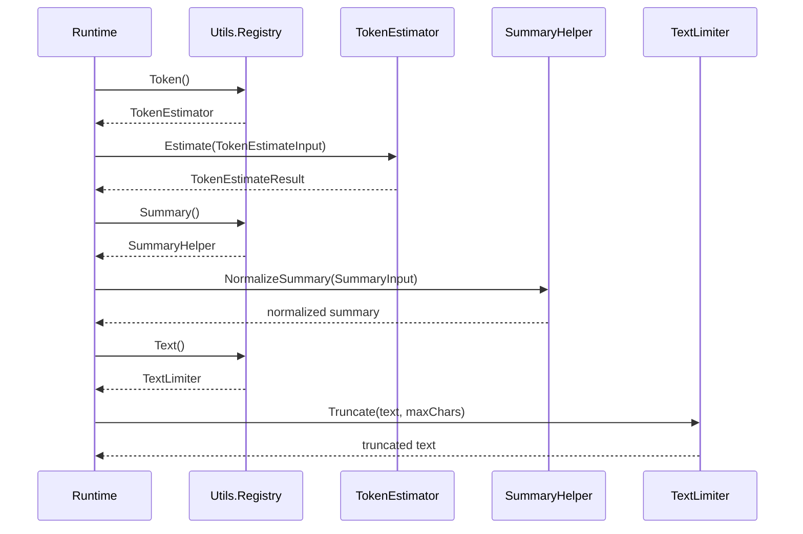
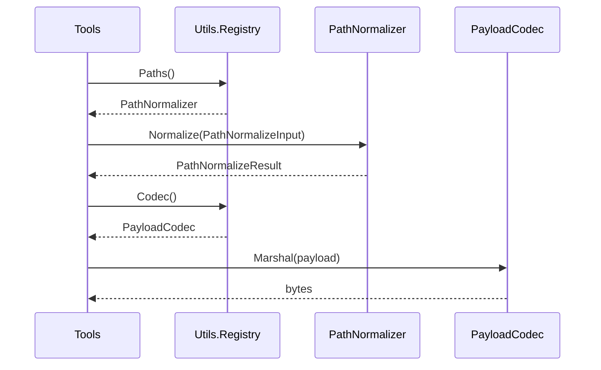

# Utils 模块设计与接口文档

> 文档版本：v3.0
> 文档定位：详细设计文档（LLD）+ 接口文档（API/Contract）

## 规范词约定

- `MUST`：必须满足的架构契约，违反会导致跨模块辅助语义分裂。
- `SHOULD`：强烈建议遵循，若例外必须记录原因。
- `MAY`：可选增强能力。

## 1. 详细设计（LLD）

### 1.1 目的与范围

Utils 模块提供跨模块复用的低副作用辅助能力，作为 Runtime、Context、Tools、Gateway 的公共底座。

Utils 模块 MUST 覆盖：

- token 估算。
- 摘要规范化与文本截断。
- ID 生成与时间抽象。
- 路径规范化与边界校验。
- 轻量序列化与反序列化。

Utils 模块 MUST NOT 覆盖：

- 运行编排、重试门禁与终态裁决。
- 会话持久化与配置存储。
- 模型调用与工具执行。

### 1.2 架构模式

- 模式：能力注册表（Registry）+ 子能力接口（能力分层）。
- 主契约：`utils.Registry`。
- 子能力契约：`TokenEstimator`、`SummaryHelper`、`TextLimiter`、`IDGenerator`、`Clock`、`PathNormalizer`、`PayloadCodec`。

### 1.3 核心流程

#### 1.3.1 Runtime 调用 Utils 的预算与收敛流程



#### 1.3.2 Tools 调用 Utils 的路径与序列化流程



### 1.4 边界与职责约束

- 上游：Runtime、Context、Tools、Gateway。
- 下游：标准库与基础能力实现。
- 边界约束：Utils 只提供能力，不持有业务状态机。

### 1.5 非功能约束

- 并发：MUST 支持并发调用。
- 可测试性：SHOULD 通过接口替换实现可控测试（如固定时钟、固定 ID）。
- 可观测性：SHOULD 保持错误码稳定，便于上游聚合。

## 2. 接口文档（API/Contract）

### 2.1 公共规范

- 所有能力 MUST 通过 `utils.Registry` 获取。
- 子能力接口 MUST 聚焦单一职责。
- 除 `TextLimiter` 与 `Clock` 外，能力方法 SHOULD 返回明确错误。

### 2.2 接口目录

| 接口 | 职责 |
|---|---|
| `Registry` | utils 模块唯一主契约，提供能力装配入口 |
| `TokenEstimator` | token 估算 |
| `SummaryHelper` | 摘要规范化 |
| `TextLimiter` | 文本截断 |
| `IDGenerator` | 标识生成 |
| `Clock` | 时间抽象 |
| `PathNormalizer` | 路径规范化与边界校验 |
| `PayloadCodec` | 轻量序列化/反序列化 |

### 2.3 关键类型目录

| 类型 | 说明 |
|---|---|
| `TokenEstimateInput` / `TokenEstimateResult` | token 估算输入输出 |
| `SummaryInput` | 摘要规范化输入 |
| `PathNormalizeInput` / `PathNormalizeResult` | 路径规范化输入输出 |

### 2.4 输入输出示例

#### 2.4.1 token 估算输入输出

```json
{
  "input": {
    "model": "claude-sonnet",
    "text": "请总结以下日志..."
  },
  "output": {
    "tokens": 128
  }
}
```

#### 2.4.2 路径规范化成功示例

```json
{
  "input": {
    "base": "/workspace/project",
    "target": "./src/../README.md",
    "allowed_roots": ["/workspace/project"]
  },
  "output": {
    "normalized_path": "/workspace/project/README.md",
    "is_inside_allowed_roots": true
  }
}
```

#### 2.4.3 摘要收敛失败示例

```json
{
  "error": {
    "code": "summary_not_converged",
    "message": "summary exceeds max_chars after normalization"
  }
}
```

### 2.5 变更规则

- `Registry` 新增子能力入口 MUST 向后兼容。
- 子能力方法签名改动 MUST 经过版本化流程。
- 关键输入输出类型字段 SHOULD 保持稳定命名。

## 3. 评审检查清单

- 是否明确 `Registry` 为唯一主契约锚点。
- 是否覆盖能力边界与不做事项。
- 是否包含核心流程图与输入输出示例。
- 是否明确 Utils 不承载编排与持久化职责。
- README 类型名是否与 `utils/interface.go` 一致。
