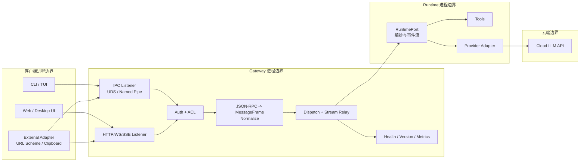
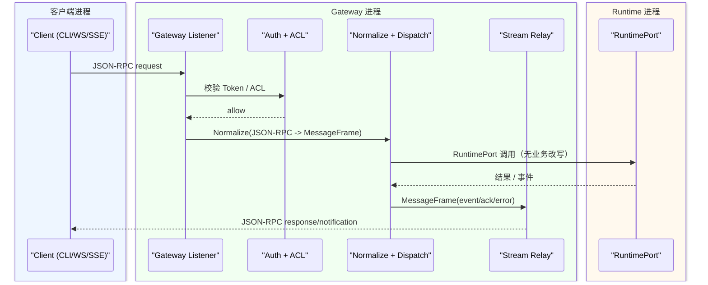
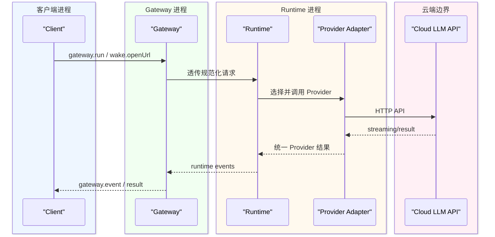

# Gateway 详细设计（EPIC-GW-06）

## 1. 目标与边界

Gateway 是 NeoCode 的协议与路由中枢，职责是：

- 生命周期管理（IPC + HTTP/WS/SSE 并行启动、优雅关闭）
- 协议归一化（外层 JSON-RPC 2.0，内层 `gateway.MessageFrame`）
- 鉴权与 ACL（`Auth -> ACL -> Dispatch`）
- 会话流式中继（session/run/channel 精准投递）

Gateway **不承载业务逻辑**，不会做模型推理、工具编排与 Provider 选择。业务执行仅由 Runtime 决定。

## 2. 架构图（含进程边界）

## 3. 核心时序图

### 3.1 本地控制面链路（Client -> Gateway -> Runtime -> Client）

### 3.2 云端调用链路（Runtime -> Provider -> Cloud API）

## 4. 数据流向（本地端与云端区别）

- 本地控制面：
  - 客户端只与 Gateway 通信（IPC/HTTP/WS/SSE）。
  - Gateway 负责协议、连接、鉴权、路由与中继。
  - 本地控制面不直接触达云端。
- 云端调用：
  - 仅 Runtime 与 Provider 层触达 Cloud API。
  - Gateway 不感知模型厂商细节，不拼接 Provider 私有字段。

## 5. 对外接口清单

### 5.1 面向客户端接口

| 接口 | 方向 | 认证 | 说明 |
|---|---|---|---|
| IPC (UDS / Named Pipe) | Client -> Gateway | `gateway.authenticate` 握手后复用 | 本地控制面主入口 |
| `POST /rpc` | Client -> Gateway | `Authorization: Bearer <token>` | 单次 JSON-RPC 请求 |
| `GET /ws` | Client <-> Gateway | `gateway.authenticate` 握手后复用 | 双向流式请求与通知 |
| `GET /sse` | Client <- Gateway | `?token=<token>` | 单向流式通知与心跳 |
| `GET /healthz` | Client -> Gateway | 无 | 健康检查 |
| `GET /version` | Client -> Gateway | 无 | 版本信息 |
| `GET /metrics` | Client -> Gateway | Bearer Token | Prometheus 指标 |
| `GET /metrics.json` | Client -> Gateway | Bearer Token | JSON 指标快照 |

### 5.2 JSON-RPC 方法

| Method | 方向 | 说明 |
|---|---|---|
| `gateway.authenticate` | request/response | 连接级鉴权，成功后复用认证态 |
| `gateway.ping` | request/response | 健康探针 |
| `gateway.bindStream` | request/response | 会话流绑定 |
| `wake.openUrl` | request/response | URL Scheme 唤醒入口 |
| `gateway.event` | notification | Gateway 推送运行时事件 |

### 5.3 面向 Runtime 接口（`RuntimePort`）

| 方法 | 说明 |
|---|---|
| `Run(ctx, input)` | 发起一次运行编排 |
| `Compact(ctx, input)` | 执行会话压缩 |
| `ResolvePermission(ctx, input)` | 回填权限审批结果 |
| `CancelActiveRun()` | 取消活动运行 |
| `Events()` | 订阅运行时事件流 |
| `ListSessions(ctx)` | 获取会话摘要 |
| `LoadSession(ctx, id)` | 加载会话详情 |

## 6. 安全与治理基线

### 6.1 Silent Auth

- Token 文件：`~/.neocode/auth.json`
- 启动网关时自动加载；缺失或损坏自动重建
- 文件结构：`version`, `token`, `created_at`, `updated_at`

### 6.2 ACL 与错误模型

- 执行顺序：`Auth -> ACL -> Dispatch`
- 错误返回统一：
  - JSON-RPC：`error.code`
  - Gateway 稳定码：`error.data.gateway_code`
- 关键稳定码：`unauthorized`, `access_denied`, `invalid_frame`, `unsupported_action`

### 6.3 默认治理参数

| 配置项 | 默认值 |
|---|---|
| `gateway.limits.max_frame_bytes` | `1048576` |
| `gateway.limits.ipc_max_connections` | `128` |
| `gateway.limits.http_max_request_bytes` | `1048576` |
| `gateway.limits.http_max_stream_connections` | `128` |
| `gateway.timeouts.ipc_read_sec` | `30` |
| `gateway.timeouts.ipc_write_sec` | `30` |
| `gateway.timeouts.http_read_sec` | `15` |
| `gateway.timeouts.http_write_sec` | `15` |
| `gateway.timeouts.http_shutdown_sec` | `2` |
| `gateway.observability.metrics_enabled` | `true` |

## 7. 配置优先级

- `flags > config.yaml > default constants`
- 当前支持通过 `~/.neocode/config.yaml` 的 `gateway.*` 段配置治理参数。

## 8. 非目标（本期）

- 不新增 Provider/Tools 业务能力
- 不引入外网公开监听与 TLS
- 不在 Gateway 内实现 Runtime 业务决策
