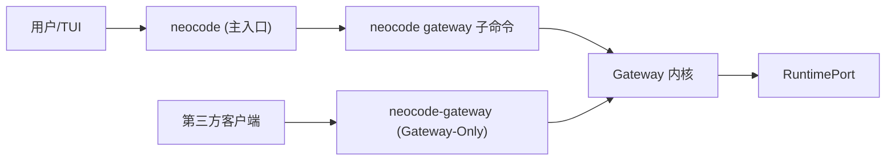
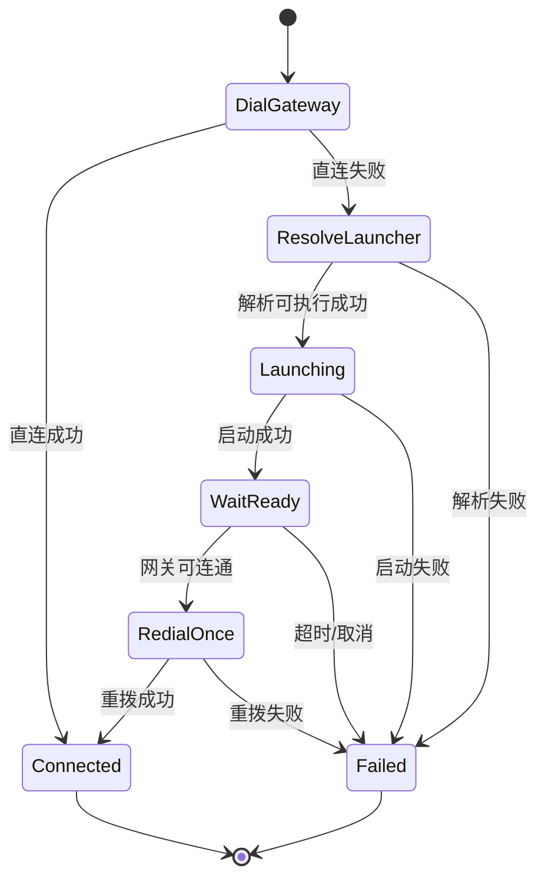

# Gateway 详细设计 RFC（RFC-420 实施版）

## 1. Abstract

本文定义 NeoCode Gateway 的工程化落地方案，目标是同时满足：

1. `neocode` 继续提供 TUI 主入口，不破坏现有使用路径。
2. 新增 `neocode-gateway` 作为 Gateway-Only 官方发布物，供第三方稳定接入。
3. 固化网关自动拉起契约与一致性测试，避免双入口长期漂移。

本文为内部设计文档，关注“为什么这样设计、如何实现、如何验收”。

## 2. Motivation

### 2.1 解耦

网关层作为控制面中继，应可被独立部署与审计。  
单独发布 `neocode-gateway` 后，第三方可以将其视为服务端组件，而不需要引入 TUI 语义。

### 2.2 并发与稳定性

URL 派发（`daemon dispatcher`）在网关未启动时需要确定性恢复策略。  
本次引入统一 launcher，固定发现顺序并限制单次回退，避免无限重试。

### 2.3 资产与运维复用

`neocode gateway` 与 `neocode-gateway` 复用同一启动内核、同一参数归一化路径。  
发布与安装通过 flavor 模式复用一套脚本，减少运维面分叉。

## 3. Architecture

### 3.1 进程拓扑

### 3.2 启动内核共享

以下逻辑必须共享：

1. 参数归一化（listen、http-listen、timeouts、limits、metrics）。
2. 配置加载与覆盖优先级（flags > config > defaults）。
3. 鉴权与 ACL 装配。
4. IPC/HTTP server 启停流程。

### 3.3 自动拉起状态机（daemon dispatcher）

发现顺序固定为：

1. `NEOCODE_GATEWAY_BIN` 显式路径
2. `PATH` 中的 `neocode-gateway`
3. `PATH` 中的 `neocode` 并追加子命令 `gateway`

约束：仅允许一次受控回退，失败后返回确定性错误。

### 3.4 子进程回收

launcher 启动网关后立即 `Release` 进程句柄，不阻塞 daemon dispatcher 主流程。  
网关生命周期由目标进程自身管理，daemon dispatcher 仅负责“拉起 + 等待可连通 + 单次重拨”。

## 4. Design Trade-offs

### 4.1 RPC vs REST

1. 控制面统一 JSON-RPC，保留请求-响应与通知语义。
2. 仅保留少量 REST 端点（`/healthz`、`/version`、`/metrics*`）作为运维辅助。

### 4.2 静默日志 vs 可观测性

1. 保持请求日志结构化（字段白名单可断言）。
2. launcher 决策日志新增关键字段：`launch_mode`、`resolved_exec`、`listen_address`、`auth_mode`。
3. 测试绑定字段语义，不绑定整行文案，降低日志格式微调带来的脆弱性。

## 5. Security & Reliability

### 5.1 认证与 ACL

1. 默认保持回环监听，不默认公网暴露。
2. 控制面执行链：`Auth -> ACL -> Dispatch`。
3. 未鉴权调用 `/rpc` 返回 `unauthorized`，供第三方稳定处理。

### 5.2 连接重置与重试

1. daemon dispatcher 仅在首拨失败时触发一次 launcher 回退。
2. 回退后仅重拨一次，避免无界重试。

### 5.3 心跳与超时

1. WS/SSE 保持心跳机制。
2. launcher 等待窗口默认 `3s`，受调用上下文截止时间约束。

## 6. Compatibility

### 6.1 稳定核心（Stable）

`gateway.authenticate`、`gateway.ping`、`gateway.bindStream`、`gateway.run`、`gateway.compact`、`gateway.executeSystemTool`、`gateway.activateSessionSkill`、`gateway.deactivateSessionSkill`、`gateway.listSessionSkills`、`gateway.listAvailableSkills`、`gateway.cancel`、`gateway.listSessions`、`gateway.loadSession`、`gateway.resolvePermission`、`gateway.event`

### 6.2 实验扩展（Experimental）

`wake.openUrl`（用于唤醒链路，后续可能继续演进）

### 6.3 版本策略

采用“稳定核心 + 实验扩展”：

1. Stable 方法遵循兼容承诺，不做破坏性变更。
2. Experimental 方法允许演进，但必须在文档标记并给出迁移路径。

## 7. Acceptance Criteria

1. `neocode gateway` 与 `neocode-gateway` 在同参场景下行为等价（归一化参数、错误结果一致）。
2. 可执行发现顺序严格按契约执行，且只发生单次回退。
3. 日志白名单字段具备自动化断言：`listen_address`、`auth_mode`、`request_id`、`method`、`source`、`status`、`gateway_code`。
4. CI 包含 gateway-only 冒烟链路：启动 -> `/healthz` -> `/rpc` 未鉴权失败 -> 清理。
5. 安装脚本支持 `full|gateway` flavor 与 dry-run，且 URL/资产/checksum 命名规则可回归验证。
## 8. HTTP Daemon Wake (Step 2.5)

为解决多数文档平台无法直接点击 `http://neocode:18921/` 的限制，引入本机 HTTP daemon 入口并与 HTTP daemon 单入口：

- 入口：`http://neocode:18921/run?...`、`http://neocode:18921/review?...`
- `daemon` 不再执行 `HTTP -> http://neocode:18921/ -> ParseNeoCodeURL` 双序列化；而是直接将 HTTP 参数映射为 `protocol.WakeIntent`，复用与 `daemon dispatcher` 相同的 IPC/RPC 派发核心。
- Gateway 在 IPC 来源下对 `wake.openUrl` 提供最小豁免（仅此方法），其余方法仍遵循既有鉴权与 ACL 约束。
- Linux 自启动采用双分支：优先 `systemd --user`，不可用时回落 `~/.config/autostart/neocode-daemon.desktop`。

迁移节奏：

1. Step 2.5 先新增 daemon 方案并人工验收。
2. 验收通过后，再在后续 PR 中移除 `http://neocode:18921/` 系统注册链路。

