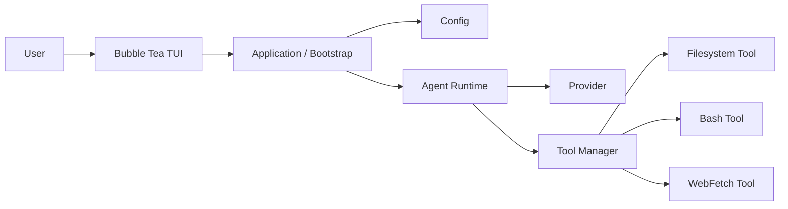
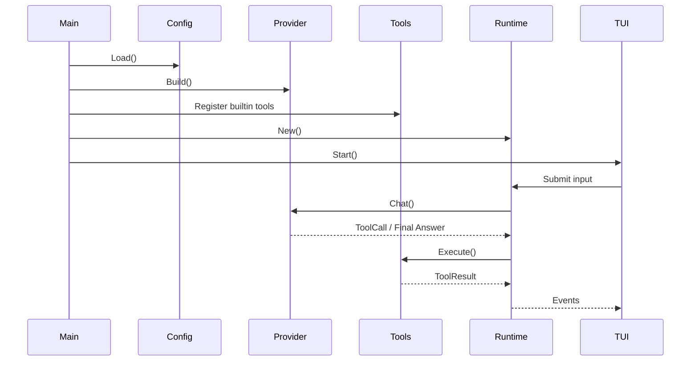

# ⚠️ 已过时：旧版 API 文档（DEPRECATED）


# NeoCode Coding Agent MVP 架构设计

## 1. 目标

本文定义一个基于 Go + Bubble Tea 的本地 Coding Agent MVP，目标是先跑通最小闭环：

`用户输入 -> Agent 推理 -> 调用工具 -> 获取结果 -> 继续推理 -> UI 展示`

MVP 聚焦六个模块：

1. provider：统一不同模型/API 的调用方式
2. TUI：用户交互入口，承载输入、对话、侧边栏、会话
3. tools：统一工具定义、参数校验、执行与结果封装
4. config：管理本地配置、provider 切换、模型选择
5. context：负责 system prompt、显式上下文源与历史消息裁剪
6. agent runtime：驱动整个 agent loop，是系统核心

---

## 2. 设计原则

- 模块职责清晰，避免 UI、模型调用、工具执行互相耦合
- 面向接口设计，方便后续增加 provider 和工具
- MVP 先保证主链路可用，不追求一次做全
- 所有副作用操作统一收敛到 provider/tools/config 等边界层
- Runtime 作为唯一编排中心，TUI 不直接调用 provider 和 tools

---

## 3. 总体架构



系统分层：

- TUI：负责交互和渲染
- Application：负责启动和依赖注入
- Runtime：负责 Agent Loop 和状态编排
- Context：负责模型请求前的上下文构建
- Provider：负责模型调用抽象
- Tool Manager：负责工具注册、校验、执行
- Config：负责配置加载与选择

---

## 4. 模块设计

### 4.1 Provider

职责：

- 屏蔽 OpenAI / Anthropic / Gemini 的协议差异
- 统一暴露聊天、工具调用、流式输出能力
- 管理 endpoint、model、api key、超时、重试

建议接口：

```go
type Provider interface {
    Name() string
    Chat(ctx context.Context, req ChatRequest) (ChatResponse, error)
}

type ChatRequest struct {
    Model        string
    SystemPrompt string
    Messages     []Message
    Tools        []ToolSpec
    Stream       bool
}

type ChatResponse struct {
    Message      Message
    FinishReason string
    Usage        Usage
}

type Message struct {
    Role      string
    Content   string
    ToolCalls []ToolCall
}

type ToolCall struct {
    ID        string
    Name      string
    Arguments string
}
```

MVP 建议：

- 第一阶段先实现一个 provider，例如 OpenAI 兼容接口
- Provider 层只关心“模型协议”，不关心 UI 和工具执行
- Runtime 把 Tool schema 传给 Provider，Provider 把 ToolCall 返回给 Runtime

---

### 4.2 TUI

职责：

- 用户输入和结果展示
- 展示会话列表、当前会话、工具执行状态
- 接收快捷键和命令
- 通过事件与 Runtime 通信

建议布局：

- 左侧：会话列表 Sidebar
- 中间：对话消息区
- 底部：输入框
- 顶部/状态栏：provider、model、workdir、运行状态

建议状态：

```go
type UIState struct {
    Sessions        []SessionSummary
    ActiveSessionID string
    InputText       string
    IsAgentRunning  bool
    StatusText      string
    CurrentProvider string
    CurrentModel    string
}
```

边界原则：

- TUI 不直接处理模型协议
- TUI 不直接执行工具
- TUI 只发送事件，例如“提交输入”“切换会话”
- Runtime 回传事件，例如“开始响应”“工具开始/结束”“最终完成”

---

### 4.3 Tools

职责：

- 定义统一工具协议
- 管理工具注册、查找、schema、执行和结果格式
- 为 Runtime 提供统一调用入口

MVP 工具：

- filesystem
- bash
- webfetch

建议接口：

```go
type Tool interface {
    Name() string
    Description() string
    Schema() any
    Execute(ctx context.Context, call ToolCallInput) (ToolResult, error)
}

type ToolCallInput struct {
    ID        string
    Name      string
    Arguments []byte
    SessionID string
    Workdir   string
}

type ToolResult struct {
    ToolCallID string
    Name       string
    Content    string
    IsError    bool
    Metadata   map[string]any
}
```

建议增加 `Registry` / `Manager`：

- 注册所有内置工具
- 暴露 `ListSchemas()` 给 Provider/Runtime
- 负责参数校验和统一错误封装
- 把工具输出转成模型可消费的结果消息

各工具 MVP 建议：

- Filesystem：读文件、写文件、列目录、搜索文件
- Bash：执行命令，限制超时、输出长度、工作目录
- WebFetch：抓取网页文本内容，限制响应大小

---

### 4.4 Config

职责：

- 从 `~/.neocode/config.yaml` 加载配置
- 管理 provider 列表、当前 provider、当前 model
- 校验配置完整性并提供默认值

示例：

```yaml
providers:
  - name: openai
    type: openai
    base_url: https://api.openai.com/v1
    model: gpt-4.1
    api_key_env: OPENAI_API_KEY

  - name: anthropic
    type: anthropic
    base_url: https://api.anthropic.com
    model: claude-3-7-sonnet-latest
    api_key_env: ANTHROPIC_API_KEY

selected_provider: openai
current_model: gpt-4.1
workdir: .
shell: bash
```

建议结构：

```go
type Config struct {
    Providers        []ProviderConfig `yaml:"providers"`
    SelectedProvider string           `yaml:"selected_provider"`
    CurrentModel     string           `yaml:"current_model"`
    Workdir          string           `yaml:"workdir"`
    Shell            string           `yaml:"shell"`
}

type ProviderConfig struct {
    Name      string `yaml:"name"`
    Type      string `yaml:"type"`
    BaseURL   string `yaml:"base_url"`
    Model     string `yaml:"model"`
    APIKeyEnv string `yaml:"api_key_env"`
}
```

建议：

- API Key 不直接写配置文件，只引用环境变量名
- 加载后生成运行时只读配置对象
- 启动时立即校验 selected provider 是否存在

---

### 4.5 Agent Runtime

职责：

- 管理会话上下文
- 调用 Provider 获取模型响应
- 识别并执行 ToolCall
- 将 ToolResult 回灌模型
- 持续循环直到得到最终答案或触发停止条件

MVP 推荐使用简化版 ReAct / Tool-Calling Loop：

1. 接收用户输入
2. 组装 system prompt + 历史消息 + tools
3. 调用 provider
4. 若返回普通文本，则输出
5. 若返回 tool calls，则执行工具
6. 将工具结果追加到上下文
7. 再次调用 provider
8. 重复直到结束

建议接口：

```go
type Runtime interface {
    Run(ctx context.Context, input UserInput) error
}

type UserInput struct {
    SessionID string
    Content   string
}
```

Runtime 内部建议拆分：

- `SessionStore`：管理会话和消息历史
- `context.Builder`：组装核心 prompt、显式上下文源与裁剪后的消息
- `Executor`：执行 loop
- `EventBus`：向 TUI 推送运行事件

停止条件：

- provider 返回最终文本
- 超过最大轮数
- 工具执行失败且不可恢复
- 用户取消

---

## 5. 核心数据模型

```go
type Session struct {
    ID        string
    Title     string
    Messages  []Message
    CreatedAt time.Time
    UpdatedAt time.Time
}

type RuntimeEvent struct {
    Type    string
    Payload any
}
```

建议事件类型：

- `user_message`
- `agent_chunk`
- `tool_started`
- `tool_finished`
- `agent_completed`
- `error`

---

## 6. 启动与依赖注入

Application 层负责把所有模块组装起来：



---

## 7. 建议目录结构

```text
.
├── cmd/
│   └── neocode/
│       └── main.go
├── internal/
│   ├── app/
│   │   └── bootstrap.go
│   ├── config/
│   │   ├── loader.go
│   │   ├── model.go
│   │   └── validate.go
│   ├── context/
│   │   ├── builder.go
│   │   ├── metadata.go
│   │   ├── prompt.go
│   │   ├── source_rules.go
│   │   ├── source_system.go
│   │   └── trim.go
│   ├── provider/
│   │   ├── provider.go
│   │   ├── openai/
│   │   ├── anthropic/
│   │   └── gemini/
│   ├── runtime/
│   │   ├── runtime.go
│   │   ├── executor.go
│   │   ├── prompt_builder.go
│   │   ├── session_store.go
│   │   └── events.go
│   ├── tools/
│   │   ├── registry.go
│   │   ├── types.go
│   │   ├── filesystem/
│   │   ├── bash/
│   │   └── webfetch/
│   └── tui/
│       ├── app.go
│       ├── state.go
│       ├── keymap.go
│       ├── views/
│       └── components/
└── docs/
    └── mvp-architecture.md
```

---

## 8. MVP 时序示例

场景：用户提问后触发一次工具调用

1. 用户在 TUI 输入问题
2. TUI 将输入发送给 Runtime
3. Runtime 读取 Session 历史
4. Runtime 获取工具 schema
5. Runtime 调用 Provider
6. Provider 返回 tool call，例如 `filesystem.read_file`
7. Runtime 调用 Tool Manager 执行
8. Tool Result 写回上下文
9. Runtime 再次调用 Provider
10. Provider 返回最终回答
11. Runtime 把结果事件发送给 TUI
12. TUI 刷新界面

---

## 9. 错误处理

Provider 错误：

- 网络错误：有限重试
- 认证错误：提示配置问题
- 限流错误：提示稍后重试
- 非法响应：记录日志并返回用户可读错误

Tool 错误：

- 参数错误：返回结构化错误
- 执行失败：不中断程序，作为 tool error 回灌
- 超时：统一包装 timeout

Runtime 错误：

- 超过最大轮数立即停止
- 构造上下文失败则结束当前请求
- 通过事件通知 TUI 展示错误

---

## 10. 安全边界

MVP 建议先加基础约束：

- Filesystem 默认限制在工作目录内
- Bash 限制超时、输出长度、禁止交互式阻塞命令
- WebFetch 限制协议和响应大小
- 配置文件不保存明文 API Key

---

## 11. 开发顺序

### Phase 1：先跑通闭环

- config
- provider 抽象 + 一个 provider 实现
- tools registry + 一个 filesystem 工具
- runtime loop
- tui 单会话输入输出

### Phase 2：增强可用性

- 会话侧边栏
- bash / webfetch 工具
- 流式输出
- 状态栏和错误展示

### Phase 3：增强扩展性

- 多 provider 切换
- session 持久化
- 更完整的权限控制
- 更丰富的工具生态

---

## 12. MVP 成功标准

满足以下条件即可认为 MVP 完成：

- 用户可在 TUI 中输入问题
- Agent 可调用至少一个模型 provider
- Agent 可调用至少一个工具
- 工具结果可回灌给模型继续推理
- UI 可展示基本会话历史和运行状态
- 配置可从 `~/.neocode/config.yaml` 加载

---

## 13. 总结

这个架构的关键是先把主链路做干净：

`TUI -> Runtime -> Provider -> Tool Manager -> Runtime -> TUI`

只要这条链路稳定，后面无论加更多 provider、更多工具，还是把 Runtime 升级成更复杂的 Agent，都不需要推翻当前设计。
