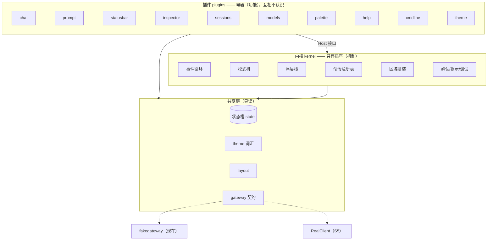

# TUI v2 设计方案 v3.2 — 内核 + 插件（经 5 轮自查 + 1 轮外部审计）

- **状态**: v3.2 审计修订版 — 已按 issue #12 与 PR #14 审计意见修订全部补丁；**本 PR（#14）合并即签收**（TUIv2-00）
- **一句话方案**: 把 TUI v2 拆成一个只管机制的**内核**和 10 个各管一摊的**功能插件**；插件之间不认识彼此，只通过内核提供的插座协作；**换主题 = 新增一个插件文件**。
- **文档怎么读**: 第 1 节讲为什么重构，第 2-7 节讲方案是什么、每个决定为什么这么做，第 8 节列出审计中砍掉的东西（证明没有过度设计），第 9 节讲每个大决定"错了怎么办"，第 10 节讲分几步做。每部分按"做什么 → 为什么 → 怎么做"组织。
- **用户已裁决**: ① 真实网关没有的 RPC 一律按 `ErrUnsupported` 显式降级，后端零改动，将来需要时一并补；② 北极星 = 美观 + 低耦合、模块分明，借鉴"万物皆插件"；③ 主题样式通过新增/修改插件自定义；④ 审计裁定（issue #12 评论）：思想批准、十插件保留（真插件 6 + 视图型 4）、confirm 维持内核服务、合入改多 PR、health 插件步骤为架构 go/no-go 门。
- **硬边界**: 改动只在 `internal/tuiv2/` 和 `cmd/neocode-tuiv2/`，后端模块一个字不动。

---

## 1. 为什么要重构（三个真问题）

**问题一：所有功能挤在一个文件里。** 现在的 `app.go` 一族（约 2700 行）同时管着：模式切换、浮层分发、15 个命令的动作、会话/模型/权限/问答的全部处理、视图拼装。后果：每加一个功能都要改这个文件的好几处，改 A 容易碰坏 B——这正是 v1 "耦合性过高"的病根，v2 目前只是程度轻一点，结构上是一样的。

**问题二：状态在事件后"搬家"。** 每来一个 Gateway 事件，状态对象会换一个新指针，10 个组件手里的旧指针全部失效，于是代码在每个事件后把 10 个组件全部销毁重建（app.go:749 的 `bindComponents`）。这已经引发过真实 bug（浮层里按回车关不掉）。根因是状态所有权没说清楚。

**问题三：同一件事有 N 套入口。** 命令面板一套命令表、`:` 命令行一套、`/` 搜索一套，handler 靠人肉保持一致；键位是 switch 函数不是数据，帮助面板的内容靠注释 `// keep in sync with keymap` 手工同步——忘了同步就会出错。

这三个问题指向同一个药方：**把"功能的归属"从"app 文件"改成"插件"，把"机制的归属"收敛到"内核"**。

---

## 2. 方案总览（一个比喻）

把 TUI 想成一排**插座（内核）**和一堆**电器（插件）**：



- **电器不认识电器**：会话插件切换会话后，发一条"会话已加载"的广播，对话插件自己听到后重载消息流——谁也不调用谁。
- **插座不含电器逻辑**：内核里禁止出现 session、permission 这类业务词（用 grep 脚本检查）。
- **加电器不改插座**：新增一个功能 = 新建一个插件目录 + 在装配处注册一行，内核和其他插件零改动。这是整个架构的核心承诺，第 9 节写了"怎么验证这个承诺没落空"。

---

## 3. 插件长什么样（契约）

**必须实现的只有 3 个方法**（小核心，避免出现"胖接口"）：

```go
type Plugin interface {
    ID() string                       // 唯一名字：状态归属、日志都用它
    Init(ctx context.Context, h Host) // 注册自己贡献的键位、命令、区域
    Close(ctx context.Context)
}
```

**能干更多事的插件，额外实现可选接口**（内核注册时自动识别，不实现就不参与）：

| 可选能力 | 谁在用（审计：≥2 个实现者才保留） | 干什么 |
|---|---|---|
| `Reactor`：React(h, msg) | chat、sessions、models、health(将来) | 收到 Gateway 事件或插件间消息，就地更新自己的状态 |
| `KeyBinder`：Bindings() | chat、prompt、cmdline、sessions…（5+） | 声明"哪个模式下按什么键做什么"，数据化，取代 switch |
| `RegionRenderer` | statusbar、stream(chat)、inspector、prompt、cmdline | 渲染主布局的一个区域；**渲染返回空串 = 该行折叠** |
| `CommandProvider` | sessions、models、chat、theme…（5+） | 往统一命令表里登记命令（命令面板/`:`/`/` 三处共用） |
| `Overlay` | palette、sessions 的选择器、models 的选择器 | 浮层对象：自带界面和按键处理，状态归自己 |

**插件唯一能看到的内核是 Host 接口**（插座）：

```go
type Host interface {
    State() *state.State        // 全局状态：读任何槽，只写自己的槽（第 6 节）
    Gateway() gateway.Client    // 调后端（fake/real 对插件透明）
    GoCmd(cmd tea.Cmd)          // 发起异步任务（RPC、定时器）
    Send(msg tea.Msg)           // 广播一条消息给所有插件
    Mode() InputMode / SetMode(m)  // 查看/切换 键位模式
    PushOverlay(o) / PopOverlay()  // 打开/关闭浮层（栈式）
    Confirm(req ConfirmRequest) // 危险确认对话框（内核服务）
    Notify(text string)         // 状态栏弱提示
    Quit()
}
```

> Host 目前只有内核一个实现，属于"单实现接口"。声明其**预期第二实现 = 插件单元测试用的 fake Host**（模拟状态和 RPC，不用起真终端）——没有这个测试替身，插件无法脱离内核做隔离测试，所以这个接口真实存在。

### 3.1 插件清单与变化触发源（P2 补丁：每个插件必须回答"我和谁独立变化"）

| 插件 | 类型 | 变化触发源（它为什么独立变化） |
|---|---|---|
| chat | 真插件 | Gateway 事件协议、对话流渲染策略 |
| prompt | 真插件 | 输入与内联审批（权限/问答）交互语义 |
| sessions | 真插件 | 会话域功能（列表/切换/删除/重命名） |
| models | 真插件 | 模型域功能与 ErrUnsupported 降级方式 |
| cmdline | 真插件 | 搜索/Ex 命令语义 |
| theme | 真插件 | 主题切换与色板定义 |
| statusbar | 视图型 | 状态槽的摘要视图，自身不演化 |
| inspector | 视图型 | 状态槽的侧栏视图，自身不演化 |
| palette | 视图型 | 命令表的搜索视图，自身不演化 |
| help | 视图型 | 键位表的渲染视图，自身不演化 |

**视图型插件的两条纪律**：① 永远不为视图型插件给内核加机制（它们没有独立演进需求）；② **inspector 与 chat 的边界**：inspector 在渲染期（View）只读 chat 拥有的 Stream/Runtime 槽与 Gateway 槽，绝不写入、不参与事件处理——数据经槽只读获取，无需广播（读时机规则见第 6 节）。

---

## 4. 内核只做 6 件事（每件为什么存在）

| 机制 | 做什么 | 为什么必须是内核的（删了会怎样） |
|---|---|---|
| 事件循环 | 唯一的 tea.Model；Gateway 事件和插件间消息**广播给所有插件** | 没有它就没有程序。广播取代了"主题总线"——有消息告诉插件，一个机制够了 |
| 模式机 | Input/Normal/Leader 三态切换、Leader 超时、按键按"浮层栈顶 → 当前模式绑定"路由 | 三层键位是全局交互骨架，插件只贡献绑定数据，模式归属权必须唯一 |
| 浮层栈 | push/pop 式浮层，栈顶独占键盘，Esc 弹栈 | 真实流程需要：会话选择器里按 Delete → 弹确认框 → 确认后**回到选择器**。单激活浮层做不到"回来" |
| 命令注册表 | 收集所有插件的命令；命令面板列它、`:` 按别名解析、`/` 按名字路由 | 一份数据三个入口，问题三的"人肉同步"就此消灭。键位绑定可标注对应命令 → 面板快捷键列**自动派生** |
| 区域拼装 | layout 算出各区域尺寸 → 依次向区域所有者要渲染结果 → 拼屏 | 视图必须有唯一拼装点；渲染返回空串即折叠该行 |
| 内核服务 | Confirm 确认框、Notify 提示、调试行（--debug） | 没有独立演进需求，是所有插件共用的机制——归内核，不当插件（审计裁定维持） |

**内核纪律（grep 脚本 + CI 检查）**：① 内核里不许出现业务词；② 插件之间禁止互相 import；③ 内核禁止 import 插件。

### 4.1 消息边界契约（P0 补丁：两条通路必须分家）

按键和消息是两种语义：按键天然是**路由**（排他、有序、栈顶优先，只有一个消费者）；Gateway 事件和插件间消息天然是**广播**（全员收到、各自过滤）。混用会让"两个插件重复消费同一按键"这类 bug 复活。三条规则写死在内核分发器：

| # | 规则 | 为什么 | 如何保证 |
|---|---|---|---|
| 1 | **KeyMsg 永不广播**：按键只走模式机路由；广播通道只承载 Gateway 事件与插件间消息 | 按键只有一个消费者，广播有 N 个——语义不同，通道必须分开 | 内核 Update 中按键与广播是两条独立代码路径；单元测试锁定（KeyMsg 形状的消息进入广播通道 → 内核拒绝） |
| 2 | **广播同步且保序**：按插件注册顺序同步调用 React，单条消息处理完才派发下一条 | 异步或乱序会让"同一条消息产生不同结果"，状态迁移不可预测 | 分发器单循环实现 + `-race` 测试 |
| 3 | **React 内禁止二次分发按键**：React 只做状态迁移与 Send/GoCmd；需要按键交互的组件走 KeyBinder 声明式绑定 | 防止插件绕过路由优先级，制造内核看不见的隐式控制流 | React 接口签名不暴露任何按键分发改写入口；代码审查 |

> 规则 1 的"拒绝"语义（S2 实现前钉死）：广播通道收到 KeyMsg 形状的消息 = **丢弃 + 记一条 debug 日志**，不报错、不 panic——插件误发不应击穿程序；真正的按键只来自终端事件源，出现丢弃即说明存在 bug，由单元测试锁定该路径。

---

## 5. 主题可定制：加一个文件就能换肤

**要达到的效果**：新增一个主题 = 新增一个插件文件 + 装配处一行注册；改主题 = 改那个文件。内核和其他插件零改动。

**为什么这么做**：主题的本质是"一份颜色/符号配置 + 一条切换命令"。它不需要内核提供任何特殊机制——用已有的 `CommandProvider` 能力就够了。刻意**不**做"主题管理器""主题加载器"这类东西（过度设计审计的结论，见第 8 节）。

**怎么做**（自定义主题插件全貌，这就是全部）：

```go
// plugins/themes/solarized/solarized.go —— 用户新增主题的全部代码
package solarized

type Theme struct{}

func (t *Theme) ID() string                      { return "theme.solarized" }
func (t *Theme) Init(ctx context.Context, h kernel.Host) {}
func (t *Theme) Close(ctx context.Context)       {}
func (t *Theme) Commands() []kernel.Command {
    return []kernel.Command{{
        Name: "/theme solarized", Description: "切换到 Solarized 浅色主题",
        Run:  func(h kernel.Host) { h.State().Theme = palette() }, // 写自己的槽
    }}
}
```

配套改动（一次性，在插件化迁移中顺带完成）：
1. `theme/` 包只留**词汇**：`Palette`（颜色+符号集+256 色降级）、渲染原语（截断/宽度计算）。
2. 取色函数从"读全局变量 TokyoNight"改为"按传入的 Palette 解析"（`theme.Accent(st.Theme)`）——渲染器迁移成插件时顺带改，golden 测试锚定视觉效果。
3. 内置主题 = `plugins/theme` 插件，提供 `/theme tokyo-night`、`/theme tokyo-night-ascii`（ASCII 符号集）命令。
4. 切换命令注册进命令表 → 在命令面板里搜 "theme" 就能发现并切换所有已装主题。

---

## 6. 状态怎么管（槽 + 广播）

**做什么**：全局只有一份 `*state.State`，指针从启动到退出**永不更换**。字段按"槽"分组，每个槽写权归唯一插件，读权开放：

| 槽 | 谁能写 |
|---|---|
| Mode / Layout.Width·Height / Notify / Confirm 结果 | 内核 |
| Layout.ScrollOffset·AutoScroll（行为流视图状态，字段级拆分） | chat |
| Stream（消息流）/ Runtime（run 状态、token） | chat |
| Input（输入框文字、历史）| prompt（经 state.ApplyInputForEvent；旧路径 Reduce 在内核接线 PR 删除前仍经同一函数写入，接线 PR 后写权归一——issue #25 移交完成） |
| Gateway.Sessions（会话列表、活跃会话） | sessions |
| Gateway.Models（模型列表、ActiveModel） | models |
| Gateway.Connected（连接健康、重连状态） | health（将来） |
| Search / Ex | cmdline |
| Theme | theme（及各主题插件切换时） |
| ~~Overlay 的 Query/Selected~~ | **删除**——浮层的输入焦点、选中项归各浮层对象自持 |

**为什么不用"事件总线"**：它与"内核把事件分发给插件"是同一件事的两个名字。两个机制合并成一个：内核把消息广播给所有插件，插件各取所需。跨插件协作只有两条路：**发具名消息**（如 `state.SessionLoaded`，类型定义在 state 包，插件互不 import 也能共享）或**渲染时读对方的槽**。

**读时机规则（P1 补丁）**：写权归唯一插件还不够——读也有时机。成文规则：**渲染期（View/Render）读任意槽合法；逻辑期（React、按键 handler）碰别人的槽禁止**，需要影响别的插件一律走广播（Send）。为什么：渲染期读是视图型插件存在的前提（inspector 读 chat 的消息流）；逻辑期互写会制造隐藏的控制流和顺序依赖，是耦合的暗门。

**写权白名单测试（P1 补丁）**：让违规在 CI 可见，而不是靠自觉。两件套：① 槽字段在 state 包内按 owner 分组子结构并标注 owner；② grep 脚本检查插件目录中不存在对他人槽字段的直接赋值（出现 `State().他人槽.字段 =` 模式即 CI 失败），配一张"插件→槽"所有权表测试锁定注册表。可选项：写路径收敛为 state 包的具名 Mutate 函数（owner 显式入参）——**先不引入**（避免每次槽写都过一层包装，过度设计回潮），CI 违规频发时再收敛，与第 8 节同一标准。

**为什么这能根治问题二**：既然指针永不更换，`bindComponents` 和它的"每事件全量重建"就失去了存在理由——直接删除。一个事件 = 各插件就地更新自己的槽 + 重渲染，全程单线程（Bubble Tea 的 Update 循环保证），原子性由结构保证而不是靠纪律。

---

## 7. 现有代码去哪里（迁移 = 重新切分，不是重写）

> **落地状态（issue #41，S3-4 内核接线，2026-09）**：app 层旧路由五文件
> （app.go / app_commands.go / app_leader.go / app_normal.go / app_view.go）
> 已删除，cmd/neocode-tuiv2 入口已切换 `NewKernelApp`。下表为迁移终态记录：
> 模式路由 → kernel mode.go + 插件 Bindings；RPC 命令 → 各插件 GoCmd；
> 布局拼装 → kernel compose + debug 插件（RegionDebug）；StartupConfig →
> app_kernel.go。keymap 包与 components 旧独用组件（palette/help/confirm/
> commands）成为死代码，扫尾清单见后续清理 issue。

| 现在 | 去向 |
|---|---|
| app.go 的模式路由、按键 switch | 内核 mode.go + 各插件的 Bindings 数据 |
| app_commands.go 的 RPC 命令工厂 | chat / sessions / models 插件内部 |
| reducer.go 的事件分支 | chat（对话类）/ sessions（会话类）/ health（将来）的 React |
| components/stream.go → plugins/chat；prompt.go → plugins/prompt | 搬迁 |
| status_bar / inspector / palette / help / cmdline / 三个 picker | 对应插件；picker 变成 Overlay 对象 |
| keymap 包 | **包删除**，Binding/Command 类型并入内核契约 |
| app_view.go 布局代码 | layout 包（最小起步，S7 响应式时扩展） |
| bindComponents | **删除**（指针不再更换，根因消失） |
| theme/ 包 + 全局 TokyoNight | theme 词汇包 + plugins/theme 插件（第 5 节） |

Phase 0-11 的成果（契约、13 个 fake 场景、主题色板、键位语义、组件渲染逻辑）全部保留，只是换了归属。

---

## 8. 审计砍掉了什么（过度设计自查的证据）

每砍一件，附砍的理由（无分叉边界 / 无第二消费者 / 与既有机制重复）：

| 砍掉/降级的东西 | 原方案里的角色 | 砍的理由 | 替代 |
|---|---|---|---|
| 主题总线（Publish/On，~50 行） | 插件间定向通信 | 与内核消息广播同源同响应——假边界 | Host.Send 广播 |
| plugins/debug 插件 | 调试行当插件 | 调试是内核自身的诊断，无独立演进需求 | 内核调试行 |
| plugins/confirm 插件 | 确认框当插件 | 确认框没有独立变化触发源，是所有插件共用的机制 | Host.Confirm 服务（审计裁定维持） |
| keymap 独立包 | Binding/Command 类型 + matcher | 一个包只装几个类型，插件要多 import 一层 | 类型并入内核契约 |
| 区域"临时认领"机制 | 搜索行临时抢占输入行 | 全设计只有一个消费者（cmdline）——投机通用化 | 渲染空串即折叠（零机制） |
| layout.Compute 的 overlayDepth 参数 | 供浮层计算 | 当前无人使用 | 需要时再加 |
| 插件私有状态 + 服务定位器 | 更纯粹的解耦 | 机制重、收益虚；单 State 槽保住全部既有测试 | 槽所有制 + 广播 |
| ThemeProvider 能力接口 | 枚举全部主题 | 当前只有命令切换一个消费者 | 主题=命令；要做主题选择器浮层时再加 |

反方向的自查（哪些差点被砍但保留了，为什么）：Overlay 栈（picker→confirm→回 picker 是真实流程）；Host.Notify（替代散落各处的提示分支）；布局包（第 6/7 步响应式和鼠标的唯一地基）。

---

## 9. 每个大决定"错了怎么办"（可证伪检查点）

| 决定 | 如果我错了，会看到什么信号 | 到时候怎么办 |
|---|---|---|
| 内核+插件架构 | 将来加功能被迫改内核（**S6 是验证点，也是 go/no-go 门，见第 10 节**） | 只修插件契约，不动已迁移插件；极端情况回退到 app 层结构（迁移按 PR 粒度可逐个回退） |
| 状态指针永不更换 | 又出现需要"重建组件/换指针"的场景 | 恢复 clone-on-write 是机械操作；当前无任何场景需要 |
| 契约按真实网关收敛 + ErrUnsupported | 接真实网关时插件层被迫大改渲染 | 说明契约泄漏了后端细节——只动 gateway 包翻译层，插件层不动 |
| RealClient 用 v1 客户端做薄翻译层 | 联调问题大量落在插件层而非翻译层 | 说明事件扁平化设计错了，回头改 real.go（它是唯一入口） |
| 布局纯函数包 | 做响应式/鼠标时组件里又出现断点判断 | 收编回 layout，一次搬迁 |
| 主题=命令+槽 | 出现"要列出全部主题"的选择器需求 | 那时再加枚举能力接口（一刻钟的事），现在不做是对的 |

---

## 10. 实施步骤（每步合并后程序都可用）

| 步 | 做什么 | 为什么排这里 |
|---|---|---|
| S0 | **规范先行**：本文档按审计补丁修订（v3.1）、签收、合入 main（TUIv2-00） | 地基不能先于规范动工（审计裁定） |
| S1 | 状态指针稳定：Reduce 就地变更，删除 bindComponents（TUIv2-01，已开 issue） | 插件"构造一次终身绑定"的前提；实现 PR 需同时对照 issue #12 正文与评论区的实现层必改项（Reduce 注释、nil 契约、守卫表合并） |
| S2 | 内核契约落地（独立 PR）+ chat、prompt 两个最难的插件先行迁移（各一个 PR） | 契约够不够用，用最难的插件检验 |
| S3 | 其余 8 个插件逐插件原子迁移，删 app 神路由，lint 三禁上 CI | 每插件一个 PR，可独立审核回退 |
| S4 | 契约收敛：事件命名一套化、方法对齐真实 RPC、ErrUnsupported 落地 | 契约债被后面每一步引用，越早还越便宜 |
| S5 | RealClient 薄翻译层 + 真实网关冒烟 | 剩余工作里不确定性最大的赌注，提前验证 |
| S6 | **新增 health 插件（断连重连）—— 架构 go/no-go 门** | **自证"新功能=新插件，内核零改动"。届时仍需改内核 = 架构预言证伪 → 按第 9 节第一行预案回退，不恋战（审计裁定）。量化验收：本 PR 相对 main 的 `internal/tuiv2/kernel/` diff 必须为空** |
| S7 | 响应式全量断点 + 最小尺寸保护 | layout 包此时扩展 |
| S8 | 鼠标插件（基于 layout 区域做点击判定） | 键盘全功能不受影响为前提 |
| S9 | golden 视觉回归（≥5 场景） | UI 面稳定后建锚，避免 golden 反复重录 |
| S10 | 真实网关全量联调 + 性能验收 | 问题按类别回溯到对应步骤 |
| S11 | 打磨发布（美观终检、文档、构建） | 最后收口 |

**合入方式（P2 补丁，用户裁定）= 多 PR**：内核契约一个 PR，此后每个插件迁移一个 PR，每个 PR 独立审核、独立回滚。上表是逻辑里程碑，落库时全部按 PR 粒度拆分，经 issue → 审核 → PR → 合并的流程逐个推进。

---

## 11. 目录树

```text
cmd/neocode-tuiv2/            # 入口：参数解析 + backend 选择（不动）
internal/tuiv2/
  app.go                      # 装配根：建内核 + 注册插件（约 100 行）
  kernel/                     # 只有机制：plugin.go kernel.go mode.go overlay.go commands.go compose.go
  plugins/                    # 功能插件（互相禁止 import）
    chat/ prompt/ statusbar/ inspector/ sessions/ models/ palette/ help/ cmdline/ theme/
    themes/                   # 用户自定义主题放这里（一个子目录一个主题）
  state/                      # 状态槽（按 owner 分组）+ 插件间消息类型（共享词汇）
  gateway/  fakegateway/      # 契约与两个实现（不动）
  layout/                     # 布局纯函数（内核基建）
  theme/                      # Palette/SymbolSet 词汇 + 渲染原语（共享）
  testdata/golden/            # S9 新建
```

> 两级目录豁免声明：Go 技术分包保留（改名纯消耗无收益），逻辑上映射——`plugins/*`=场景层，`kernel|state|layout|theme|gateway`=共享/基建层。

---

## 12. 审计记录

| 轮 | 审什么 | 发现 | 处置 |
|---|---|---|---|
| R1 | 是否符合 arch-design 七条理论 | Host 单实现未声明第二实现；可选能力接口未列实现者；confirm 作为插件没有独立变化触发源；主题总线与事件分发同源同响应=假边界 | 补声明、补审计表；confirm 降内核服务；总线并入广播 |
| R2 | 每个模块必要吗（删了会怎样） | keymap 包只装几个类型；debug 插件无独立演进需求；bus 有替代 | 砍 keymap 包、debug 插件、bus |
| R3 | 有没有过度设计 | 区域临时认领只有一个消费者；depth 参数无人用；各能力接口经清点均 ≥2 实现者（合法） | 砍认领与 depth；实现者表留档（第 3 节） |
| R4 | 主题可定制（用户裁决 3） | 原"轻插件"方案不给用户明确的自定义路径 | 确立"主题=插件文件+命令"，零新机制，示例进文档（第 5 节） |
| R5 | 表达与终检 | 前版文档术语密集、无"为什么"主线 | 全文按 做什么/为什么/怎么做 重写；门禁对账通过 |
| **外部审计** | **issue #12 评论（用户，2026-09-11）**：五轮高阶风暴 | 插件思想成立；内核 6 件全数必要（命令注册表最强、事件循环存疑→并入 4.1 边界）；**最大缺口=按键路由与广播没分家**；**槽读权是最大的洞**；对 10 个插件本身缺必要性审计；health 插件步骤应为 go/no-go 门；合入应改多 PR | 裁定"思想批准"；全部采纳为 v3.1 补丁：P0 消息边界契约（4.1）×消息三规则；P1 槽读时机+写权白名单（第 6 节）、S6 go/no-go（第 10 节）；P2 触发源标注+inspector/chat 边界（3.1）、多 PR（第 10 节） |

---

## 13. 拍板问题（已全部闭环）

- **Q1 插件粒度** → 裁定（issue #12 第 1 轮）：10 个保留，分类为"真插件 6 + 视图型 4"，视图型守两条纪律（见 3.1）。
- **Q2 合入方式** → 裁定：多 PR（内核契约一个 + 每插件一个），见第 10 节。
- **Q3 确认框归属** → 裁定：维持内核服务（Host.Confirm）。

---

## 14. ADR 索引（引用锚点）

> 本节是代码注释与 PR 中 "ADR-xxx" 引用的唯一权威落点。状态标记：✅ 已落地 / 📋 规划。
> 每条 ADR 的证伪信号触发时，按第 9 节对应预案处置。

### ADR-001 状态指针全程稳定

- 决策：ViewState 指针从启动到退出不更换；`Reduce` 与一切状态迁移就地修改（语义见第 6 节）。
- 状态：✅ 已落地（PR #17，issue #12，guard 测试 `TestReduceReturnsSamePointerForAllEvents`）。
- 证伪信号：再次出现"组件重建/指针重绑"需求即预言失败 → 预案：恢复 clone-on-write + 组件重绑（第 9 节第 2 行）。

### ADR-002 契约对齐真实 RPC + ErrUnsupported

- 决策：`gateway.Client` 以真实 RPC 文档（docs/reference/gateway-rpc-api.md 与 docs/reference/tui-gateway-contract-matrix.md）为唯一权威收敛；真实网关缺失的能力返回 `ErrUnsupported`，UI 显式降级，后端零改动。
- 状态：✅ 落地（S4，issue #44）。事件词汇收敛（27→23，删 4 对别名+拼写对齐 runtime 权威）+ 词汇权威源三类分组（A=envelope 同名 / B=gateway 层 / C=客户端派生）+ Client 13 方法 RPC 映射标注 + ErrUnsupported 哨兵 + 形状冻结/钉值测试。审计核实：当前 13 方法在真实网关侧全部有已注册实现（ErrUnsupported 为面向未来扩展的契约，零候选方法）；S4 事件词汇与 runtime 对齐使 S5 RealClient 翻译层可机械化。
- 证伪信号：接真实网关时插件层被迫大改渲染 = 契约泄漏 → 只动 gateway 翻译层。

### ADR-003 布局纯函数包

- 决策：布局计算唯一出处 = `layout.Compute` 纯函数；断点逻辑不得散落组件。
- 状态：✅ 落地（S7，issue #50）。layout 包断点常量具名（MinWidth 20/MinHeight 5/DefaultVisibleLines 8/MinVisibleLines 4/StreamReservedRows 7/StreamHeaderRows 1）；stream 的 streamWidth/visibleLineCount 收编（golden 矩阵零 diff 等价迁移）；statusbar/prompt 切 Render(width) 参数真相源（stream View(width) 穿参 Compute——chat 插件透传，宽参与 Layout 槽同源）；最小尺寸保护=MinSizeBreached + AmbientStatus 提示段（禁 clamp-up/禁拒渲染）。
- 已知限制：Inspector 宽屏侧栏维持隐藏——compose 无横向拼接机制，激活产生形变；横向拼接+Inspector 恢复为独立后续项（S7b，含 UI/UX 214-218 三档定义核对）。0x0 截断防线失效与纵向溢出登记已知限制。宽度维 MinSizeBreached 提示段在窄终端渲染时会被行截断裁剪（呈现限制，登记）。
- 证伪信号：组件内再现断点判断 → 收编回 layout。

### ADR-004 RealClient = 薄翻译层

- 决策：RealClient 只读复用 v1 `internal/gateway/client.GatewayRPCClient`（认证/心跳/重试/通知内建），仅做方法映射与事件扁平化。
- 状态：✅ 落地（S5，issue #46）。13 方法全部实装（单通知泵+订阅扇出、最小键归一化映射表、phase 值翻译、无 envelope 外层错误帧、request_id 双槽追踪回填）；构造期单泵裁定源自通知通道单接收者事实（per-subscription 泵会在换代窗口竞争偷事件）。边界禁 4 同步演进：放行 internal/gateway/client（仅客户端包，依赖闭包审计干净）。插件层零 diff（证伪信号未触发）。
- 证伪信号：联调问题大量落在插件层而非翻译层 → 事件扁平化设计返工，只动 real.go。

### ADR-005 重连 = health 插件

- 决策：断连视觉 + 指数退避重连实现为独立 health 插件；退避常量可注入。
- 状态：✅ 落地（S6，issue #48，**架构 go/no-go 门通过**：`git diff fc71eac5 -- internal/tuiv2/kernel/` 输出 0 行——kernel/ 零改动，"新功能=新插件"预言自证成立）。
- 落地形态：两相探针循环（探针 cmd 只做 Health[5s 独立超时]、React 经注入退避纯函数计算间隔并由续订 cmd 睡眠后回流）+ 全分支无条件重武装 + Close 停止位；恢复边沿（unhealthy→healthy）Notify + Send(GatewayRecovered{}) 广播 → sessions 四守卫重绑（边沿/空会话跳过/运行态跳过/不广播 SessionLoaded——恢复不得清空对话流）；Connected 槽写权自 sessions 临时承接移交 health；断连持久视觉=AmbientStatus offline 段；权限外 B 组事件直写槽（不经 ApplyGatewayForEvent 新分支）。
- 已知限制（S6 审计实例2 P0-1）：**僵尸流盲区**——v1 通知通道断连不关、订阅通道三关闭路径不含断连、B 组事件真实链路无 producer：传输透明重连（心跳自愈）场景下订阅流已死而探针恒报健康，恢复重绑永不触发。覆盖范围=网关宕机→重启恢复。演进展望：RealClient 暴露传输复位信号（不触 kernel）。
- 已知行为（S6 审计 P2-c）：恢复重绑不复位 Phase=Error（Phase 槽归 chat），登记为接受差异。
- 证伪信号：新增插件仍需改内核 = 架构预言证伪 → 按第 9 节回退，不恋战。

### ADR-006 golden 视觉回归后置

- 决策：teatest golden 在 UI 面（S2-S8）稳定后建立（≥5 场景），避免 golden 反复重录。
- ADR-008 扩展（S8，issue #52）：MouseHandler 可选能力接口 + OverlayMouseHandler 可选浮层接口——MouseMsg 两级路由（栈顶 Overlay.HandleMouse 优先→栈空遍历 MouseHandler 插件），不进广播（ADR-009 规则 1 不变）。MouseHandler 实现者：chat（stream 滚轮 ScrollBy ±3）；OverlayMouseHandler 实现者：palette overlay（滚轮选项滚动 + 左键选择 + Y-2 锚定行 0）。§4.5 缺口登记：Stream 条目点击（无可点击 affordance）、输入框定位光标（需 Y→光标偏移映射）、picker 左键（Align(Center) Y 映射在 kernel 路径必错）——登记后续。
- 状态：📋 规划（S9）。
- 证伪信号：无（流程决策）。

### ADR-007 内核 + 插件架构

- 决策：功能即插件、机制归内核；lint 三禁（插件互不 import / kernel 不 import 插件 / kernel 无业务词）进 CI。
- 状态：📋 规划（S2-S3）。
- 证伪信号：S6 门见 ADR-005；内核被迫加业务词即失败。

### ADR-008 小核心 + 可选能力接口

- 决策：Plugin 最小面（ID/Init/Close）；Reactor/KeyBinder/RegionRenderer/CommandProvider/Overlay 为可选能力，注册时类型断言发现；每个能力接口 ≥2 真实实现者。
- 状态：📋 规划（S2）。
- 证伪信号：某能力接口只剩 1 个实现者且无第二实现预期 → 按第 8 节标准砍。

### ADR-009 槽所有制 + Host.Send 广播

- 决策：单一 State 按 owner 分组槽位，写权唯一；跨插件协作 = 具名消息广播（KeyMsg 永不广播，见 4.1）。
- 状态：📋 规划（S2）。
- 证伪信号：出现插件间直接函数调用/互写槽 → 违反纪律，grep 白名单测试拦截。

### ADR-010 命令/键位/帮助单一注册表

- 决策：palette / `:` / `/` 三入口共用命令注册表；帮助内容与面板快捷键列自动派生，消灭 keep-in-sync。
- 状态：📋 规划（S2）。
- 证伪信号：再现手工同步注释即回潮。

### ADR-011 浮层对象化 + 栈式焦点

- 决策：浮层状态归 Overlay 对象自持；内核只管 push/pop 栈，栈顶独占键盘，Esc 弹栈。
- 状态：📋 规划（S2）。
- 证伪信号：浮层状态重新进入全局 ViewState 即回潮。

### ADR-012 Confirm/Notify/调试行 = 内核服务

- 决策：无独立变化源、被所有插件共用的机制归内核服务（Host.Confirm / Host.Notify / 调试行），不设插件。
- 状态：📋 规划（S2）。
- 证伪信号：服务需要按调用方定制外观时再评估插件化（审计裁定维持现状）。

### ADR-013 主题 = 插件文件 + 命令

- 决策：新增主题 = 新增插件文件 + 注册一条 `/theme xxx` 命令；内核零主题机制；`theme/` 包只留 Palette/SymbolSet 词汇与渲染原语。
- 状态：📋 规划（S3 theme 插件迁移时落地）。
- 证伪信号：出现"枚举全部主题"的选择器需求 → 再加枚举能力接口（第 8 节）。
